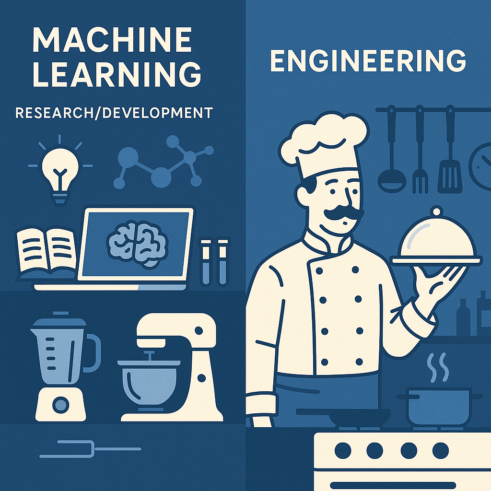

# Machine Learning Engineering

When most people hear "machine learning," they imagine a unified field. But here is the truth: there are actually two distinct disciplines hiding under the same name.

One is building the **algorithms**: the research, theory, and innovation of how machines learn. Think of it like inventing new kitchen appliances. The other is **applying those algorithms** in the real world: scaling them, maintaining them, and delivering business value. That's more like running a real restaurant kitchen. Both are essential. But confusing them can cause serious problems in teams and expectations. Would you hire an electrical engineer to make your wedding cake?

In my opinion, organizations struggle to apply machine learning algorithms not because they lack the theoretical knowledge, but because they lack the technical muscle to **turn models into value**. Despite open source libraries and advanced frameworks, model deployment remains painfully slow. Why? Because the hardest problems are not algorithmic: they are engineering. Challanges such as: (a) data ingestion pipelines; (b) feature engineering in production; (c) model versioning and reproducibility; (d) real-time testing and monitoring; (e) scalable deployment and lifecycle management; are engineering problems, not just data science problems.

💡 The positive aspect of this situation is that the field of applied machine learning engineering is finally 𝗿𝗲𝗰𝗲𝗶𝘃𝗶𝗻𝗴 𝘁𝗵𝗲 𝗮𝘁𝘁𝗲𝗻𝘁𝗶𝗼𝗻 it merits. This phase serves as a crucial bridge between the initial stages of prototyping and the subsequent transition to production, as well as between the theoretical potential of a project and its actual impact.

 
𝗥𝗲𝗳𝗲𝗿𝗲𝗻𝗰𝗲𝘀
🔗 A. Burkov **"Machine Learning Engineering"**, [2020](https://leanpub.com/MLE)

#MachineLearning 
#MLOps 
#DataScience 
#MLEngineering 
#AppliedML

Image created by ChatGPT.

