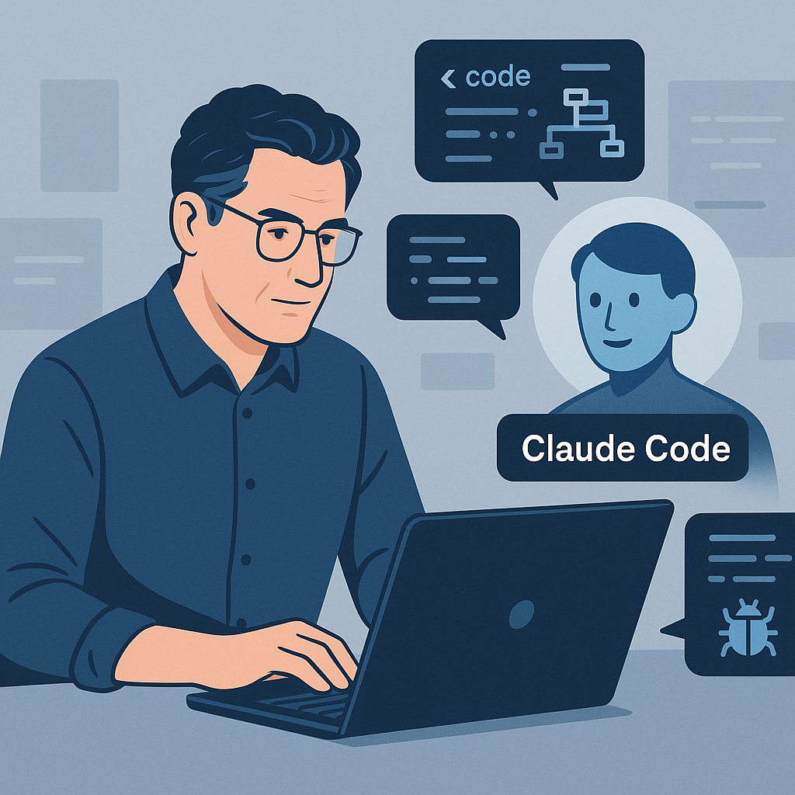

# Claude Code an Agentic Coding Tool


As a senior software developer who has witnessed many technological evolutions, I am rarely surprised. However, Anthropic’s new Claude Code Agent caught my attention for all the right reasons.

Claude's Code Agent is more than just an AI assistant that suggests a line or two of code. It's more like an autonomous, persistent, **context-aware developer**. It reads your repository, understands your architecture, and can execute multi-step refactoring tasks or build entire features with minimal human intervention. It's agentic, not reactive. That’s a significant advancement.

## Main Features
- **Autonomous Workflows**: Claude doesn't just provide a code snippet. It plans, writes, tests, and iterates.
- **Context depth**: Thanks to its context window of over 200,000 tokens, it maintains architectural consistency across large codebases.
- **Interactive Debugging**: Assign a bug to it, and it will trace the root cause, propose a fix, apply changes, and explain its reasoning.

For developers, this represents a shift from writing code ourselves to orchestrating agents that write code for us. For engineering leaders, it invites a new way of thinking about productivity. Instead of measuring productivity in lines of code, it is now measured by delivered outcomes.


💡 Could this be the beginning of AI pair programming? It's possible. Tools like Claude aren’t replacing developers. However, they are **reshaping our roles**. We're evolving from code authors to code reviewers. We're shifting from builders to architects.

 
## References
🔗 Claude Code overview, [May 2025](https://www.anthropic.com/claude-code)

```
#Anthropic
#ClaudeCodeAgent 
#SoftwareDevelopment 
#Innovation
#Productivity
```


Image created by ChatGPT.


