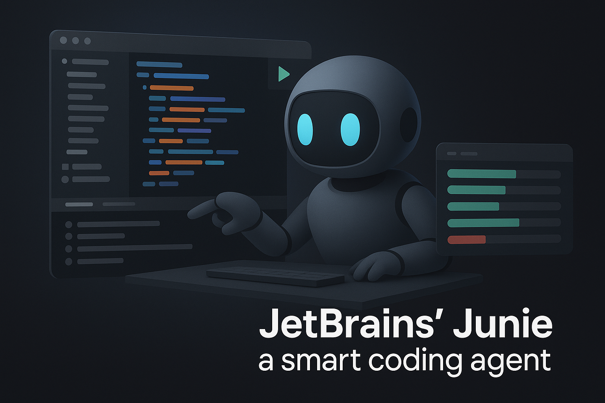

# JetBrains' Junie: a Smart Coding Agent

JetBrains has introduced Junie, an AI coding assistant that surpasses traditional code suggestions. Junie can autonomously execute multi-step development tasks within your IDE.


## What is Junie?
Junie is designed to autonomously handle tasks such as navigating project files, running code, executing terminal commands, and modifying the file system. It uses the core tools of JetBrains IDEs, such as source code navigation and code inspections, to plan and carry out complex tasks and ensure that everything runs smoothly after changes are made.


## Key Capabilities
- **Autonomous Task Execution**: Junie can perform tasks independently or collaborate with a developer. It can handle routine tasks or assist with more complex work.
- **Project Context Awareness**: This tool uses project context and structure to analyze and search code, enabling you to make informed decisions while executing tasks.
- **Code Quality Assurance**: Junie runs code and performs tests to reduce warnings and errors. Junie also verifies the state of the project and the results of the tests after changes are made.


## Performance Metrics
In the SWEBench Verified benchmark, which comprises over 500 programming tasks, Junie achieved a success rate of 53.6% in a single run. This indicates its ability to adapt to software development tasks of varying complexity.


## Integration and Availability
Junie is available as a plugin for JetBrains IDEs, including IntelliJ IDEA Ultimate and PyCharm Professional. It also supports WebStorm and GoLand. It operates under the JetBrains AI license, which includes Junie and the AI Assistant. The license offers a free tier. 


💡 Junie is a significant advancement in AI-assisted development. It offers developers a tool that suggests code and actively participates in the development process. This enhances productivity and code quality.


## References
🔗 Junie, [Your smart coding agent](https://www.jetbrains.com/junie/)

```
#JetBrains
#CodeAgent 
#SoftwareDevelopment 
#Innovation
#Productivity
```

Image created by ChatGPT.



