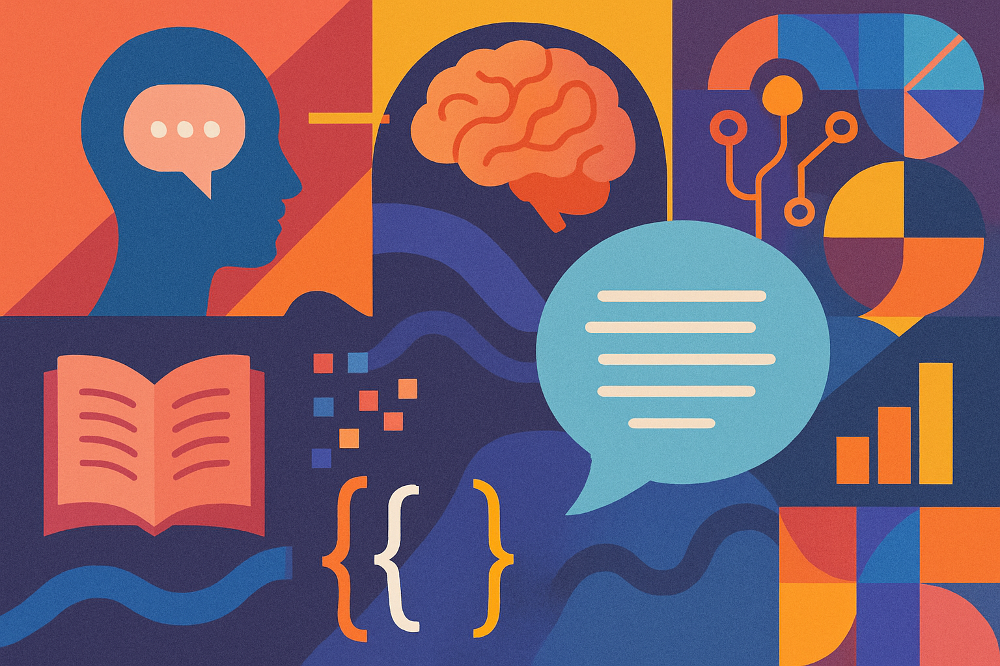

# Natural Language Processing


Natural Language Processing (NLP) has become one of the most transformative branches of Artificial Intelligence (AI), **revolutionizing** the way we interact with technology and with each other.

From chatbots that assist with customer service to **generative AI** models that can summarize entire articles or generate content, NLP is behind some of the most innovative tools in both business and research today. This is more than just a technology trend. It is reshaping communication, productivity and problem solving across all industries.

It is the interdisciplinary nature of NLP that makes it so powerful. It combines elements from:
- **Linguistics**, to understand grammar and sentence structure;
- **Philosophy**, to model meaning and knowledge;
- **Psychology**, to unravel the connections between words and human behavior;
- **Statistics** and **machine learning**, to build predictive models from large sets of textual data;
- **Computational linguistics** and data mining, to develop intelligent language agents;

Recent advances, particularly in Large Language Models (LLMs) and Generative AI, have brought NLP into the spotlight. These technologies are now enabling hyper-personalized customer experiences, automating complex workflows, and even generating code, insights, or creative content from simple prompts.

Many of the commercial tools we rely on today (e.g., voice assistants, search engines, translation apps) are based on breakthroughs in NLP. And this is just the beginning. As the technology matures, we will continue to see broader integration into healthcare, law, finance, and education.

💡 The comprehension of NLP has expanded beyond the confines of data scientists and engineers. This ability constitutes a fundamental component of the AI-driven workplace.


 
## References
- 🔗 R. Lee **"Natural Language Processing A Textbook with Python Implementation"**, [2025](https://doi.org/10.1007/978-981-99-1999-4)
- 🔗 M. Surdeanu, M.A. Valenzuela-Escárcega **"Deep Learning for Natural Language Processing A Gentle Introduction"**, [2024](https://doi.org/10.1017/9781009026222)
- 🔗 Y. Haralambous **"A Course in Natural Language Processing"**, [2024](https://doi.org/10.1007/978-3-031-27226-4)


```
#ArtificialIntelligence 
#NLP 
#GenerativeAI 
#MachineLearning 
#DataScience
```


Image created by ChatGPT.



