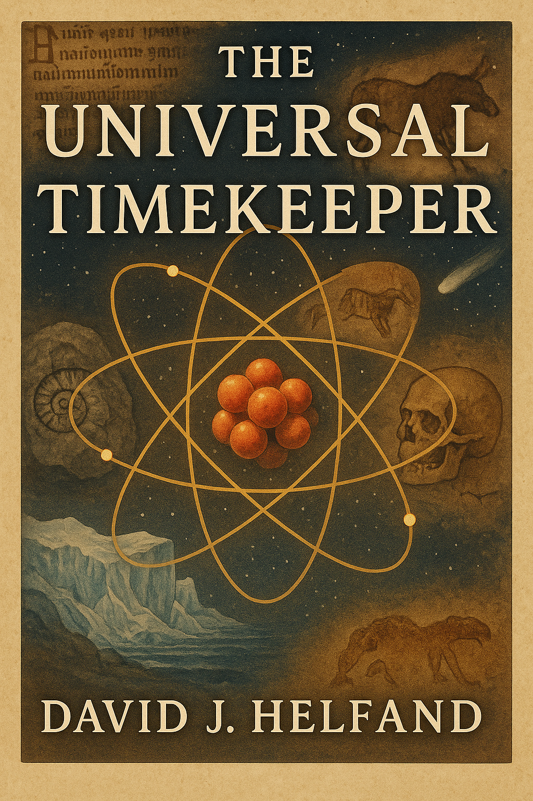

# The Universal Timekeeper

**David J. Helfand**, the author of the book **"The Universal Timekeepers"**, invites us to consider an extraordinary idea: that the most honest, consistent, and far-reaching storytellers in our universe are atoms. Yes, atoms.

The same microscopic entities that make up our bodies, power our technology, and keep our clocks ticking are also the **natural recorders** of the cosmos. With the right tools and questions, we can read their "memories"-embedded in the structure of ancient rocks, works of art, ice cores, and even the enamel of ancient teeth. This is **empirical science**, not poetic metaphor.

A medieval manuscript touched up in 1896, a Paleolithic cave painting created 17,150 years ago, the gold in your wedding ring forged in the death throes of a star, these are no secrets if you ask atoms. They remember. And they are willing to tell us everything, if we know how to listen.

Helfand takes us on a journey that spans 13.8 billion years, tracing how we use **atomic structure** and behavior to decipher the past, from the Big Bang to yesterday's climate. Along the way, we explore how **isotopic analysis** is reshaping archaeology, geology, climatology, and forensics, revealing the secrets of ancient diets, the extinction of the dinosaurs, the age of the Earth, and even the origin of life.

What struck me most was the book's central premise: history is not written only by human hands. In fact, the atoms in a glacier or a meteorite can carry records far more detailed - and far older - than any text or relic.


💡 For anyone involved in science, education, history, or technology, **The Universal Timekeepers** is a reminder that our best tools for understanding the world may lie in the theory and observation of the smallest building blocks of matter itself: atoms.


 
## References
🔗 D. J. Helfand **"The Universal Timekeeper: Reconstructing History Atom by Atom"**, [2023](https://cup.columbia.edu/book/the-universal-timekeepers/9780231219037/)


```
#Physics 
#Atom 
#Science 
#Isotops
#Technology
```

Image created by ChatGPT.





