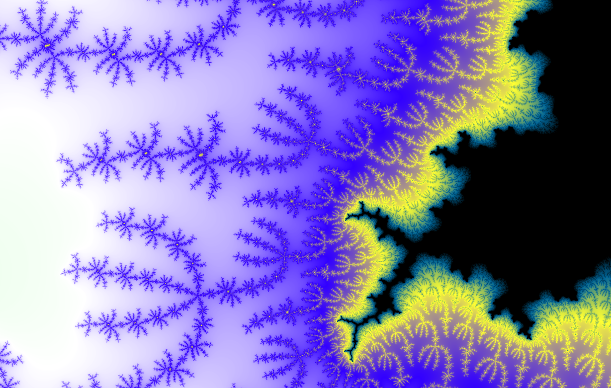

# GRASP for Solving Hard Optimization Problems

After 25 years of practical success, GRASP (Greedy Randomized Adaptive Search Procedures) finally receives the comprehensive treatment it deserves. **Optimization by GRASP, by M. G. C. Resende and C. C. Ribeiro**, is an essential resource for anyone facing complex combinatorial optimization challenges.


## What Makes GRASP Powerful
GRASP was originally introduced in 1989 to solve set covering problems. It has since evolved into a remarkably versatile metaheuristic. This algorithm combines intelligent greedy construction, adaptive randomization, and local search, making it easy to implement. Its elegant simplicity has led to its adoption in various industries, such as telecommunications network design, supply chain planning, and transportation scheduling.


## 𝗪𝗵𝘆 𝗧𝗵𝗶𝘀 𝗕𝗼𝗼𝗸 𝗠𝗮𝘁𝘁𝗲𝗿𝘀
Unlike scattered academic papers, this volume consolidates decades of research into a coherent framework. The authors masterfully cover everything from foundational concepts to advanced hybridizations involving path relinking and parallel implementations. What sets this volume apart is its dual purpose. It serves as an accessible introduction to metaheuristics for beginners while providing experienced practitioners with state-of-the-art techniques.

The book's structure is well-thought out. It begins with the basics of combinatorial optimization, moves on to GRASP fundamentals, and concludes with sophisticated extensions. Implementable templates accompany each algorithm, bridging the gap between theory and practice.


GRASP offers a reliable method for finding approximate solutions to NP-hard problems, for which exact solutions are computationally impractical. The book Optimization by GRASP is an invaluable reference, thanks to its comprehensive annotated bibliography alone.


 
## References
+ M. G. C. Resende and C. C. Ribeiro "Optimization by GRASP", [2016](https://link.springer.com/book/10.1007/978-1-4939-6530-4)
+ The fractal image was created using the [JavaScript Fractal Explorer](https://jsdw.me/js-fractal-explorer/) program, which was written by James Wilson.


```
#OperationsResearch 
#Optimization 
#Metaheuristics 
#GRASP 
#CombinatorialOptimization 
```



