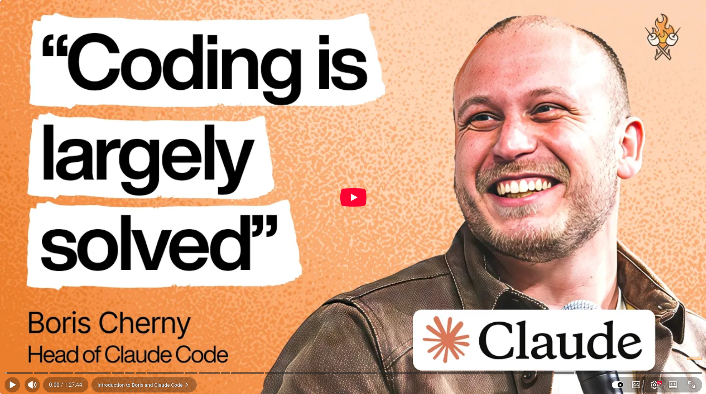

# "Coding is largely solved" - Boris Cherny, Head of Claude Code at Anthropic

I've spent decades writing in C++. Debugging memory leaks at 2 a.m. Profiling heap snapshots. I've obsessed over type systems.

So, when I watched this interview with Boris Cherny, Anthropic's Head of Claude Code, I was taken aback.


## Here's what hit me:
+ Boris hasn't written a single line of code by hand since November 2025. As a highly productive engineer and former top performer at Instagram, he now submits 10–30 AI-generated pull requests daily. He has five agents running in parallel during the interview.

+ At Anthropic, productivity per engineer has increased by 200%, while the number of employees has grown fourfold.

+ The hardest part was when he described debugging a memory leak. The classic approach involves heap snapshots, specialised debuggers, and careful trace analysis. It was his approach. However, a newer team member simply asked Claude Code to handle it. Claude took the heap snapshot, wrote an analysis tool on the fly, found the bug, and opened the pull request faster than Boris could.

+ Claude Code currently accounts for 4% of all GitHub commits, and this figure is expected to reach 20% by the end of the year.

+ He drew an analogy with the printing press. Before Gutenberg's invention, fewer than 1% of Europeans were literate, and scribes held a monopoly on reading and writing. Within 50 years of the printing press being invented, more material had been printed than in the previous thousand years combined. Over the next two centuries, literacy rates climbed to 70%. Boris sees programming in the same way. It's not disappearing; it's becoming more democratic.

+ The next frontier isn't better code generation. It's about Claude using your feedback, bug reports, and telemetry data to determine what to develop next.

+ As someone who still appreciates the elegance of a well-typed C++ system, I'll admit that this isn't necessarily a bad thing. It's the tedium disappearing so that thinking can flourish.


**So, what does this mean for us as engineers? ** The term 'software engineer' may soon be replaced by 'builder' using Claude Code as the main tool.

💡 The question isn't whether to adapt. It's how quickly.


## References
+ Claude Code from Anthropic, [2026](https://claude.com/product/claude-code)
+ Interview with Boris Cherny, Head of Claude Code, [Feb 2026](https://www.youtube.com/watch?v=We7BZVKbCVw)


```
#AI
#SoftwareEngineering
#ClaudeCode
#FutureOfWork 
#CPlusPlus
```



