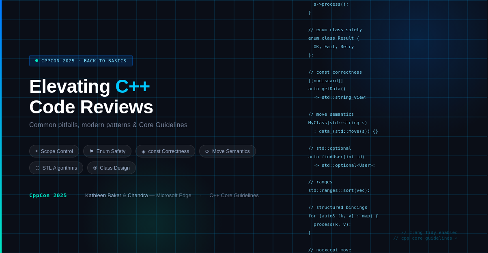

# Elevating C++ Code Quality: Lessons from CppCon 2025


At CppCon 2025, Chandranath Bhattacharyya and Kathleen Baker presented an informative and practical talk on improving C++ code reviews. It's a must-watch for any C++ developer.


Their presentation grew out of a real problem: inconsistent practices create compounding technical debt when hundreds of engineers work on a shared codebase. They systematically cataloged the most common issues and turned them into actionable guidelines, many of which were drawn directly from the **C++ Core Guidelines**.


## Scope control is underrated

Variables that outlive their logical context are a subtle source of bugs. Scoping variables within `if`, `switch`, and `for` blocks makes the code cleaner and easier to understand, and it actively reduces the risk of unintended modification.


## Use an enum class instead of a C-style enum

C-style enums lack type safety, pollute the enclosing namespace, and resist forward declaration. The `enum class`, however, fixes all three of these problems and is directly recommended by the **C++ Core Guidelines**. It is equally important to handle all enum values explicitly in switch statements and avoid relying on the default case for future additions.


## Passing and return types matter more than you think

For example, passing non-trivial objects by value when a const reference or an `std::string_view` would suffice creates unnecessary copies. Returning const values suppresses move semantics. Using `std::optional` and `std::expected` to encode success or failure in the type system is a cleaner, safer alternative to using boolean output parameters.


## Class design discipline pays off

Initialize members at the point of declaration. Mark functions as const or static if they don't modify state. Consistently define all special member functions. For example, a user-defined destructor can silently suppress move operations, which is a trap that even experienced developers can fall into.


## Use the available tools

**Clang-Tidy** automatically identifies these issues with checks such as `cppcoreguidelines-pro-type-member-ini`, `readability-make-member-function-const`, and `bug-prone-inaccurate-erase`. By having the compiler and linter catch structural problems, reviewers can focus on logic and design.


The broader message is that code reviews are not only about identifying bugs, but also about establishing shared standards. These guidelines are based on the C++ Core Guidelines.


## References
+ C++ Core Guidelines, [2026](https://isocpp.github.io/CppCoreGuidelines)
+ Back to Basics: How to Improve C++ Code Reviews, [CppCon 2025](https://www.youtube.com/watch?v=mMrIwY1n74g)
+ Clang-Tidy, [2026](https://clang.llvm.org/extra/clang-tidy/)


```
#CPlusPlus
#CppCon
#CodeReview
#SoftwareEngineering
#CppCoreGuidelines
```



