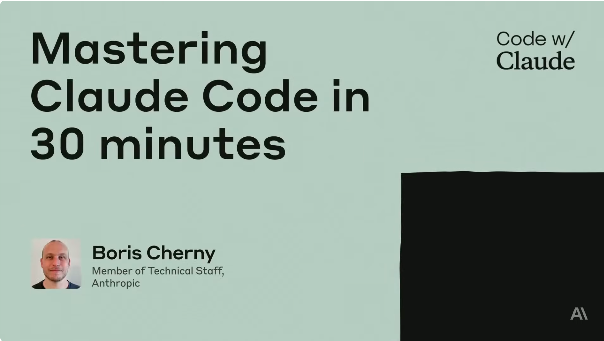

# Claude Code for Experienced C++ Developers

After years of writing in C++ and navigating memory management, templated abstractions, and sprawling codebases of thousands of files, I've come to appreciate one thing above all else: tools that understand not just the syntax, but the code itself. Claude Code does exactly that.

Claude Code is more than just autocomplete. It's an agentic coding partner designed for the way real development actually works.


## Full Codebase Awareness

C++ projects are notoriously complex, involving header hierarchies, translation units, build systems, and deep dependency chains. Claude Code maps your entire project structure and identifies cross-file dependencies before you make a single edit. Say goodbye to copy-pasting isolated snippets out of context.


## Intelligent Debugging

In the past, tracking down a segfault or undefined behavior across multiple source files required hours of digging through logs. Claude Code, however, analyzes error reports, traces issues across files, and suggests targeted fixes — all from the terminal and without disrupting your workflow.

## Automated Build & Git Workflows

Claude Code integrates directly with your CLI tools. It can run `CMake` builds, execute test suites, interpret compiler output, and draft pull requests, reducing the friction between passing a test and committing cleanly.

## Architecture-Aware Refactoring

Refactoring C++ templates, abstract base classes, and legacy codebases without introducing regressions is a high-stakes task. Claude Code plans multi-step refactors with an understanding of the broader system, not just the parts affected.

## CLAUDE.md for Team Standards

You can embed your coding conventions, such as naming rules, memory management policies, and preferred idioms, directly into a `CLAUDE.md` file. At the start of every session, Claude Code reads the file, ensuring that the output is consistent with your team's standards.

What is the most important aspect? Codebase context. Every other benefit stems from Claude Code's ability to understand your entire project. That's what sets it apart from other tools — it understands.


If you're a C++ developer and haven't explored Claude Code yet, it's worth a serious look.


## References
+ Claude Code, [Feb 2026](https://claude.com/product/claude-code)
+ Mastering Claude Code in 30 minutes, [23th May 2025](https://www.youtube.com/watch?v=6eBSHbLKuN0)


```
#CPlusPlus
#SoftwareDevelopment
#ClaudeCode
#AITools
#AgenticCoding
```



