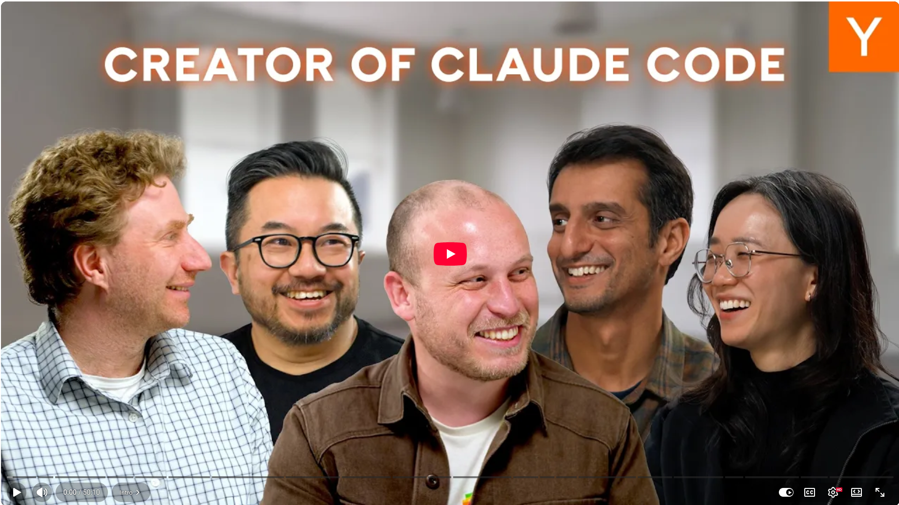

# Inside Claude Code with Boris Cherny


I just watched one of the most eye-opening tech interviews right now. Boris Cherny, the creator of Claude Code, pulled back the curtain on how it was built, where it's going, and what it means for every developer.


## It started as a mistake

Boris didn't set out to build a command-line interface (CLI). He created a small terminal chat application to learn the Anthropic API because it was the most cost-effective way to avoid developing a UI. The terminal was never intended to be the final product. However, it accidentally became one of the most widely adopted developer tools in 2025.


## The "moment" that changed everything

 Boris gave the early model a try and asked, "What music am I listening to?" Claude wrote an AppleScript on the fly, scripted his Mac, and found the answer. His reaction: "The model just wants to use tools. That's all it wants." This moment shaped the entire product philosophy.


## Build for the model 6 months from now, not today

This is Boris's core advice for every founder working with LLMs. Optimizing for what the model can currently do will cause you to be surpassed tomorrow. A better bet is to identify areas where the model is currently weak and wait. It will get there.


## Productivity numbers that are hard to believe

Since the launch of Claude Code at Anthropic in early 2025, productivity per engineer has grown by 150%, as measured by pull requests and verified by commit quality. 


## The entire codebase is rewritten every few months

None of the Claude Code code from six months ago exists today. Tools are added and removed every few weeks. The scaffolding is replaced as the model improves. 


## Plan mode has a limited lifespan

Boris predicts that the model will soon be able to plan on its own. Plan mode only adds one sentence to the prompt: "Please don't code." That's it. The real insight is that as the model's capabilities grow, we'll need less scaffolding, not more.


## The role of "software engineer" is evolving

At Anthropic, everyone from product managers to designers to finance teams to engineering managers writes code. Engineers will spend more time writing specifications, communicating with users, and directing agents than they will on writing code line by line.


What strikes me most is the discipline behind it all: ship the simplest thing possible, obsessively listen to users, avoid over-engineering, and never bet against the model.


## References
+ Claude Code, [Feb 2026](https://claude.com/product/claude-code)
+ Inside Claude Code With Its Creator Boris Cherny, [Feb 17, 2026](https://www.youtube.com/watch?v=PQU9o_5rHC4)


```
#CPlusPlus
#SoftwareDevelopment
#ClaudeCode
#AITools
#AgenticCoding
```




