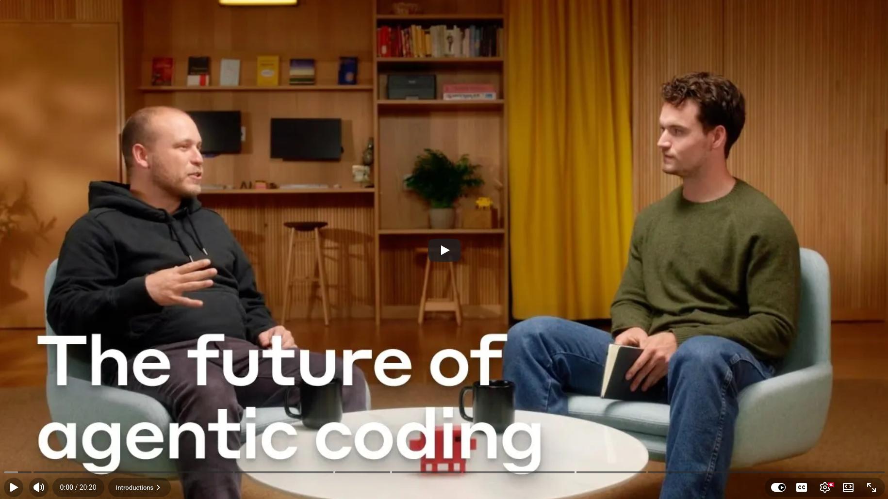

# Claude Code: the future of software engineering


I recently watched a fascinating interview with Boris Cherny, the creator of Claude Code at Anthropic. It changed the way I think about the future of software engineering.

A year ago, "AI in coding" meant autocomplete and copying and pasting from a chat window. Now, it means having an agent that writes code, explores your codebase, reads Git history, pulls in Sentry logs, and handles entire pull requests. This allows you to focus on what matters most: the idea.

A few things from the interview that stood out to me:


## On how models and tooling co-evolve

It's not just about a smarter model. The "harness," which includes system prompts, context management, tools, and permissions, matters just as much. As Boris explained, the model is like a powerful horse, but the scaffolding determines how well you can steer it.


## On evaluation

Despite creating one of the world's most sophisticated developer tools, Boris believes the best way to evaluate a new model is to use it for a day of real work. "The biggest signal by far is just the vibe." This is an important lesson for anyone developing AI-powered products.


## On what work looks like in 12–24 months

We're moving up the abstraction stack — from editing individual files, to submitting full pull requests (PRs), to creating goal-oriented agents that proactively implement changes and request your approval. This shift means that developers will spend less time on implementation details and more time on judgment, architecture, and direction.


## On how to prepare

Boris's advice is worth taking seriously. You still need to learn the craft. Knowledge of languages, compilers, and system design never goes away. Now, though, if you have an idea, you can actually build it. The barrier between "concept" and "working product" is lower than ever.


Here are two practical tips from Boris for using Claude Code:
+ First, ask questions about your codebase before writing code. Get comfortable with the agent doing research before trusting it to build.
+ Categorize your tasks: Easy ones go straight to an automated pull request (PR), medium ones start with a plan, and hard ones keep you in the driver's seat with Claude as a pair programmer.


## We're at an inflection point

The engineers who will thrive aren't necessarily the fastest typists. Rather, they're the ones who can think clearly about problems, communicate intent precisely, and know when to relinquish control and when to maintain it.


The code itself is no longer precious. However, the idea behind it is.


## References
+ Claude Code, [Feb 2026](https://claude.com/product/claude-code)
+ The future of agentic coding with Claude Code, [Sep 2, 2025](https://www.youtube.com/watch?v=iF9iV4xponk)


```
#ClaudeCode
#AIEngineering
#AgenticCoding
#SoftwareDevelopment
#Anthropic
```



