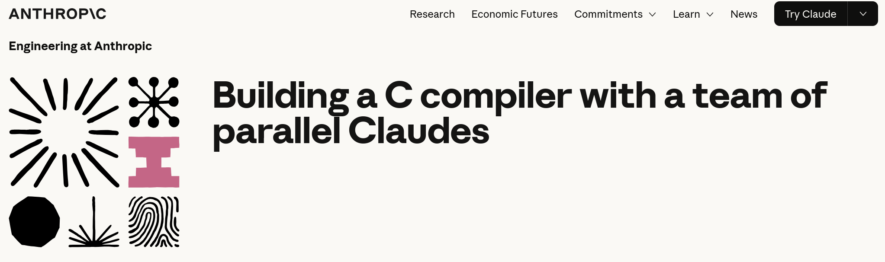

# Claude wrote a C compiler

Anthropic researcher Nicholas Carlini conducted a fascinating experiment in which he tasked sixteen parallel Claude (Opus 4.6) agents with building a fully functional, Rust-based C compiler capable of compiling the Linux kernel with minimal human intervention.

After nearly 2,000 Claude Code sessions and $20,000 in API costs, the result was a 100,000-line compiler that can build Linux 6.9 on x86, ARM, and RISC-V, pass 99% of GCC torture tests, compile QEMU, FFmpeg, PostgreSQL, and Redis, and run Doom.


**The approach, called "agent teams"**, involved multiple Claude instances working in parallel on a shared Git repository. Each agent claimed tasks via file-based locking, pushed changes upstream, autonomously resolved merge conflicts, and selected the next task — all without human intervention.

**The agents were assigned different roles:** one focused on code duplication, one on compiler performance, and one on documentation. This is specialization at scale, achieved without the need for an orchestration agent.


Key engineering lessons from the experiment:
+ **Test quality is paramount.** Autonomous agents will optimize for whatever signal you provide. If your tests are flawed, the agent will "solve" the wrong problem.

+ **Design for the agent's cognitive constraints.** Avoid context window pollution. Pre-aggregate log data. Provide progress summaries to help agents orient themselves in new environments.

+ **Parallelism requires careful task decomposition.** When all agents encountered the same bottleneck (compiling the Linux kernel), progress stalled. The solution was to use a binary search strategy with GCC as an oracle to determine which files Claude's compiler was failing on. This enabled the agents to work on different bugs simultaneously again.

**Where it still falls short.** The compiler lacks a 16-bit x86 code generator and delegates to GCC for real-mode boot. It has no standalone assembler or linker, and its output code is less efficient than GCC's output with optimizations disabled. While impressive, it is not production-ready.

**The broader implication.** We're transitioning from using AI as a pair of programmers to using it as an autonomous engineering team. That's genuinely exciting! However, it's also concerning. Deploying software without human verification poses a real risk, and maintaining that standard will only become more difficult as these systems grow in capability.


## The right response isn't to slow down

Instead, we should develop clearer evaluation frameworks and CI/CD guardrails, as well as a better understanding of where autonomous systems can and cannot be trusted.


## References
+ Claude from Anthropic, [Feb 2026](https://platform.claude.com/docs/en/home)
+ Building a C compiler with a team of parallel Claudes, [Feb 5, 2026](https://www.anthropic.com/engineering/building-c-compiler)


```
#SoftwareEngineering
#AIAgents
#ClaudeAI
#LLM 
#Anthropic
```




