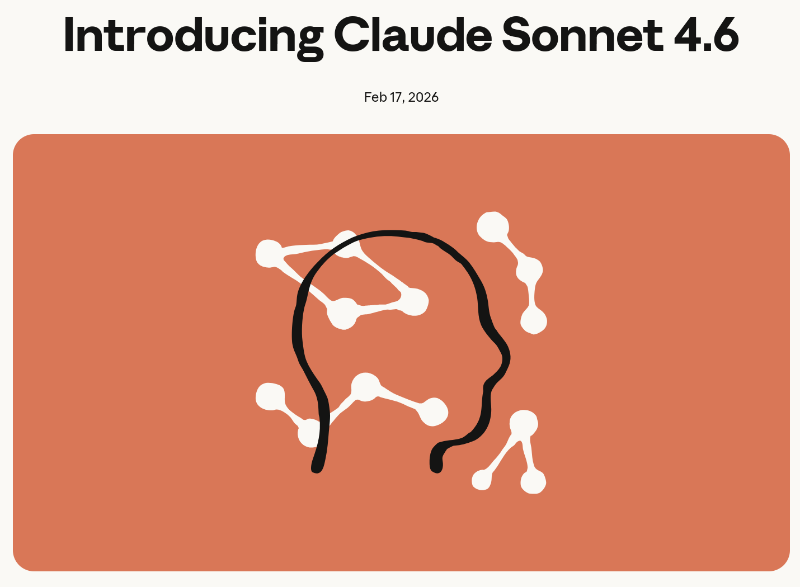

# Claude Sonnet 4.6 is here 

Anthropic just released Claude Sonnet 4.6. After examining the changes, I believe this version is significant.

A few things that stand out to me as a developer:

**The coding quality rivals that of frontier models.** In Claude Code testing, Sonnet 4.6 was preferred to the previous Opus 4.5 — Anthropic's most capable model just three months ago — by 59% of users. There is less overengineering and hallucinations, and better instruction following and follow-through on multi-step tasks. The latter is enormously important in real-world agentic workflows.

**One million token context window (beta).** Entire codebases, lengthy contracts, and dozens of research papers are all accessible with a single request. Even more impressive is that the model effectively reasons across all that context, rather than just ingesting it. Long-horizon planning tasks demonstrate significant improvement.

**Computer use is becoming increasingly practical.** Sonnet 4.6 demonstrates nearly human-level capability when performing tasks such as navigating complex spreadsheets and filling out multi-step web forms. It also demonstrates significant advancements in resistance to prompt injection attacks, which is a critical safety concern for any agentic deployment.

**The pricing is compelling.** It's the same price as the Sonnet 4.5 ($3 or $15 per million tokens), but it has the performance of an Opus-class model. This changes the economics of what you can build.

**For teams using Excel.** The Claude add-in now supports MCP connectors, allowing you to pull in data from S&P Global, PitchBook, FactSet, and others without ever leaving your spreadsheet. This small change will save you from a lot of context-switching.

💡 **The broader takeaway:** the gap between "capable" and "frontier" models is narrowing faster than most people expected. If you haven't revisited your model selection lately, now's a good time.


## References
+ Claude from Anthropic, [Feb 2026](https://platform.claude.com/docs/en/home)
+ Introducing Claude Sonnet 4.6, [Feb 17, 2026](https://www.anthropic.com/news/claude-sonnet-4-6)


```
#SoftwareDevelopment
#ClaudeAI
#Anthropic
#GenerativeAI
#LLM
```




