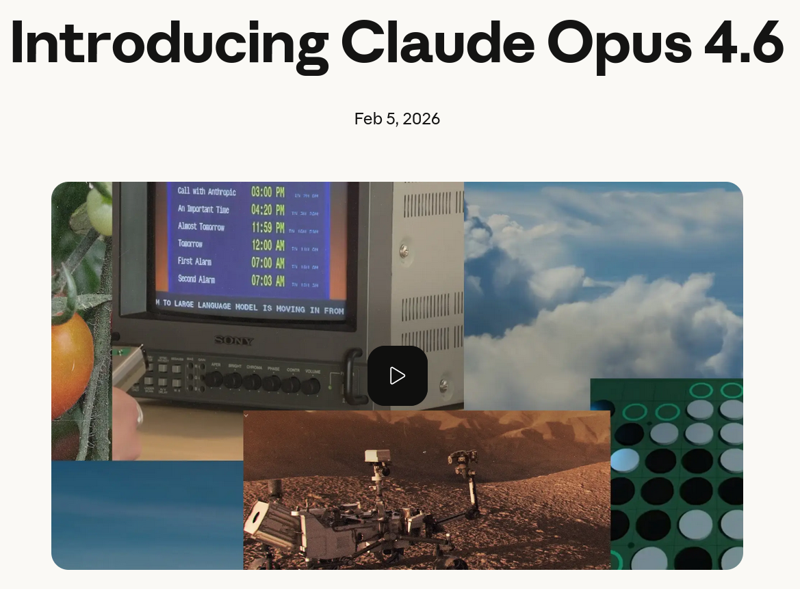

# Claude Opus 4.6 is now available


Anthropic just released its most advanced model yet, with upgrades that go well beyond incremental improvements.

What stands out from a developer's perspective:

**Claude Opus 4.6 sets a new standard** on Terminal-Bench 2.0, the leading agentic coding evaluation, outperforming GPT-5.2 by approximately 144 Elo points on GDPval-AA. GDPval-AA measures performance on real-world knowledge work in finance, law, and other fields. That's not a rounding error.

**The context window is now 1M tokens (in beta).** For those working with large codebases, long conversations, or document-heavy pipelines, this represents a significant improvement — not just an increase in size. On the MRCR v2 "needle in a haystack" benchmark, Opus 4.6 scores 76% versus 18.5% for Sonnet 4.5. Context rot has been a real pain point, and this update directly addresses it.

New API capabilities worth exploring:
  • **Adaptive thinking:** The model decides when deeper reasoning is warranted rather than using a binary on/off switch.
  • **Effort controls:** Tune for speed, cost, or intelligence depending on your use case. Options include low, medium, high, and max.
  • **Context compaction:** Auto-summarizes older context so long-running agents don't hit limits.
  • **128k output tokens:** Complete large-output tasks in a single request.

**In terms of products, Claude Code** (research preview) allows agent teams to create parallel subagents for code reviews and complex tasks. The new Claude in Excel and the Claude in PowerPoint preview round out a significant expansion into everyday knowledge work.

**In terms of safety**, Opus 4.6 maintains the same alignment profile as its predecessor while achieving the lowest over-refusal rate of any recent Claude model. Improving intelligence without sacrificing safety is the right direction.

The API (claude-opus-4-6) is now available on claude.ai and major cloud platforms. The price remains at $5/$25 per million tokens.


💡 **The pace of progress here is remarkable.** If you're building with AI or evaluating frontier models for production use, Opus 4.6 deserves a close look.


## References
+ Claude from Anthropic, [Mar 2026](https://platform.claude.com/docs/en/home)
+ Introducing Claude Opus 4.6, [Feb 5, 2026](https://www.anthropic.com/news/claude-opus-4-6)


```
#SoftwareDevelopment
#ClaudeAI
#Anthropic
#GenerativeAI
#LLM
```




