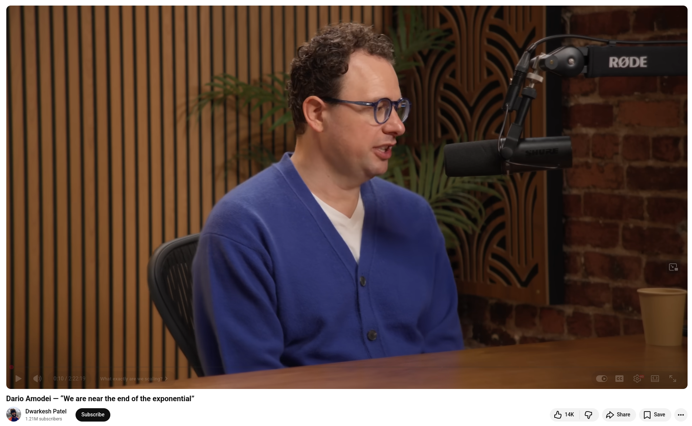

# Anthropic reshapes software development

I just finished watching the interview with Dario Amodei conducted by Dwarkesh Patel, and it's one of the most important pieces of content I've consumed this year. As a software developer, it changed how I think about the next two to three years of my career.

## On the pace of progress

Since 2017, Dario has maintained the same core hypothesis: the "Big Blob of Compute." This concept comprises three components: raw computing power, data quality, and the right objective function. That's it. He has watched models progress from the level of a "smart high school student" to that of a "beginning Ph.D. student" in just a few years. Now, RL scaling follows the same log-linear laws as pre-training. The frontier is uneven, but the trajectory is not.

## On software engineering specifically

He presented a spectrum ranging from 90% to 100% of the code being written by AI. He believes that, within one to two years, full end-to-end software engineering will be possible, including technical direction, design documents, testing, and deployment. He's over 90% confident that this will happen within a few years.

## On the "country of geniuses in a data center"

This is Dario's shorthand term for AGI-level systems. He estimates that it will take one to three years. He is highly confident that by 2035, there will be a 90% chance of success. After that point, the bottleneck won't be capability; it will be economic diffusion.

## On what we get wrong about diffusion

He pushed back on the idea of using "diffusion" as an excuse. Although AI diffuses faster than any prior technology, there are still real obstacles, such as enterprise procurement, security reviews, and change management. Even Claude Code, which is spreading faster than any enterprise tool he has seen, takes months, not days, to implement at large organizations.

## The part that hit hardest

Dario said the most surprising thing about the last three years is that people inside and outside the industry are still debating the same old hot-button issues, even though, in his words, we are near the end of the exponential era. He described this situation as "absolutely wild."


💡 The interview is worth three hours of your time.


## References
+ Claude Code, [Mar 2026](https://claude.com/product/claude-code)
+ Dario Amodei — "We are near the end of the exponential", [Feb 13, 2026](https://www.youtube.com/watch?v=n1E9IZfvGMA)

```
#AI
#SoftwareEngineering
#Anthropic
#ClaudeCode
#FutureOfWork
```


