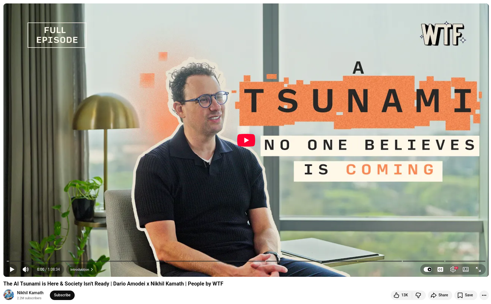

# Claude as the part of AI Tsunami

I just watched the full interview between Anthropic CEO Dario Amodei and Nikhil Kamath, and it's one of the most sobering conversations about AI that I have encountered this year.

Dario's central metaphor stuck with me: "It's as if a tsunami is coming at us. It's so close that we can see it on the horizon, yet people are coming up with explanations for why it's not actually a tsunami."

## The Awareness Gap is Real

Despite the fact that models are potentially months away from reaching human-level intelligence, there is a surprising lack of public recognition. Technical progress is happening faster than societal preparation.

## Quality Trumps Everything

AI models exhibit a power-law distribution of capability, similar to the difference between hiring the best programmer and the 10,000th best programmer. Price doesn't matter as much as you'd think. The smartest model wins.

## Your Career Strategy Needs Recalibration

Dario's advice: Focus on human-centered work, the physical world, and critical thinking skills. Pure coding is the first to be automated, but software architecture, design thinking, and managing AI systems will persist longer. The 5% you contribute is amplified 20x by AI handling the remaining 95%.

## The Application Layer Opportunity

For builders: Don't just create simple wrappers. Establish real competitive advantages through domain expertise, regulatory knowledge, or specialized relationships. Anthropic releases new models every two to three months, each of which creates new possibilities that weren't previously viable.


## The Biotech Renaissance is Coming

As a former biologist, Dario predicts that AI will revolutionize the discovery of drugs. He is particularly optimistic about peptide-based therapies and programmable medicine.

## What struck me most was:

Dario's intellectual honesty regarding the concentration of power in AI and his advocacy for regulations that would constrain his own company. Regardless of whether you agree with his approach, it's rare to see a CEO actively working against their own commercial interests for the greater good.


💡 The interview reminds us that we are not just observers of this transformation; we are participants. The question isn't if AI will reshape our world, but how thoughtfully we'll do so.


## References
+ Claude Code, [March 2026](https://claude.com/product/claude-code)
+ The AI Tsunami is Here & Society Isn't Ready | Dario Amodei x Nikhil Kamath | People by WTF, [24th Feb 2026](https://www.youtube.com/watch?v=68ylaeBbdsg)


```
#AI
#ArtificialIntelligence
#TechLeadership
#SoftwareDevelopment
#FutureOfWork
#Anthropic
```




