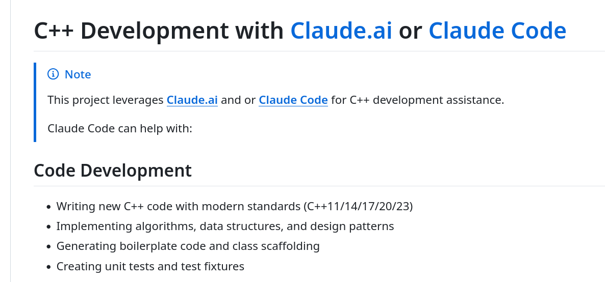

# Evaluating Claude Sonnet 4.6 for C++23 Code Generation

As a C++ practitioner who cares deeply about code quality, I recently conducted a structured evaluation of Claude Sonnet 4.6 (Anthropic) as a development assistant for modern C++ programming. The focus was strict: C++23 compliance and adherence to the C++ Core Guidelines, the authoritative best-practices framework led by Bjarne Stroustrup and Herb Sutter.

The complete evaluation, including all generated code and review reports, is publicly [available on my GitHub](https://github.com/romz-pl/cpp-claude-evaluation)

## What I Tested
I designed a sequence of nine progressively challenging tasks that target different aspects of real-world C++ development:
+ Dynamic polymorphism
+ Global variable with managed lifetime
+ Random number generator wrapper
+ Two threads and I/O
+ Global variable with managed lifetime in C++23
+ Producer–consumer pattern
+ AVL tree implementation in C++23 (code generation)
+ AVL tree evaluation in C++23 (code review)
+ Pool allocator conforming to the std::allocator contract

**This range of tasks was intentional.** It spans object-oriented programming (OOP) design, concurrency, data structures, memory management, and the allocator model. In other words, these are the areas where C++ becomes challenging and where guideline compliance truly matters.


## Overall Assessment
For senior C++ developers, Claude Sonnet 4.6 is a genuinely capable pair programming assistant. It is particularly strong in the following areas:
+ Scaffolding modern, guideline-compliant class designs.
+ Reviewing existing code against C++ Core Guidelines.
+ Explaining the why behind design decisions, not just producing code.

It is not a replacement for domain expertise or thorough testing. However, when used as an informed assistant, where the developer retains control over architectural decisions and validation, it can substantially accelerate the development of high-quality C++ code.


## References
+ Claude Code by Anthropic, [March 2026](https://claude.com/product/claude-code)
+ C++ Development with Claude.ai or Claude Code, [5th March 2026](https://github.com/romz-pl/cpp-claude-evaluation)


```
#CPlusPlus
#ClaudeCode
#ClaudeAI 
#LLM 
#CppCoreGuidelines
```



