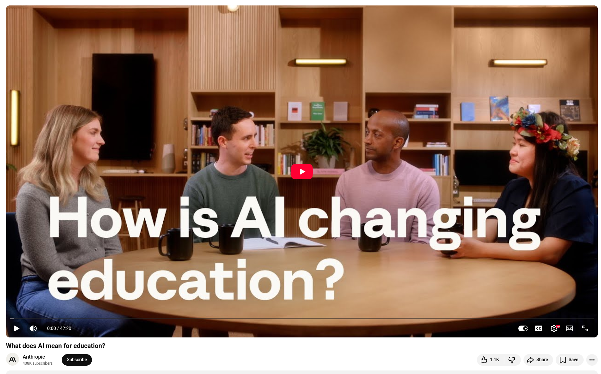

# Claude as the personal tutor

Recently, four members of the Anthropic team sat down to discuss the promise and tension that AI brings to teaching and learning. The conversation was honest, nuanced, and deeply personal. Many of them are parents. Several are former educators. All of them feel the weight of their responsibility.

A few themes stood out:

**The opportunity is real.** Research shows that, on average, students who receive one-on-one tutoring perform above those who do not. AI makes this level of personalized learning accessible to everyone, regardless of geography or resources. That's transformational, not incremental.

**However, the risks are just as real.** Nearly half of student interactions with Claude are transactional; students are looking for answers rather than seeking to understand. AI is performing at the highest levels of cognitive tasks such as analysis, synthesis, and creation, while students risk doing less of that work themselves. This should give us pause.

**Critical thinking is the most important skill, not prompting.** The team's AI Fluency curriculum isn't about hacks or shortcuts. Rather, it's about helping students, teachers, and parents ask better questions, model uncertainty, and recognize when AI should not be used, a concept that may be just as important as knowing when it should be used.

**The human element is irreplaceable.** The goal isn't to automate teaching. Instead, the goal is to free teachers from tedious tasks so they can focus on what only they can do: build relationships, inspire curiosity, and recognize each student as an individual.

💡 As one of the team members said: "There's never been a better time to have a problem."


## References
+ Claude, Anthropic, [March 2026](https://claude.com)
+ What Does AI Mean for Education?, [16th Dec 2025](https://www.youtube.com/watch?v=Uh98_aGhAuY)


```
#ClaudeAI
#AgenticCoding
#Anthropic
#AI 
#ProblemSolving
```



