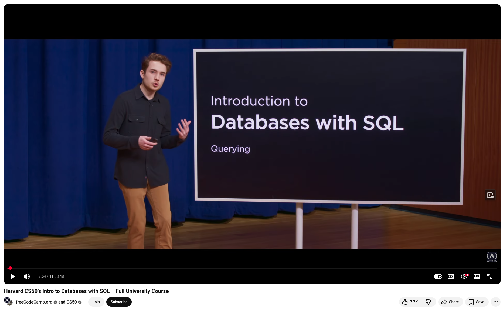

# Intro to Databases with SQL - Harvard CS50

Quote from the course description:

This is CS50’s introduction to databases using a language called SQL. 

+ You'll learn how to create, read, update, and delete data with relational databases, which store data in rows and columns. 
+ You'll also learn how to **model real-world entities** and relationships among them using tables with appropriate types, triggers, and constraints. 
+ Then you'll learn how to **normalize data** to eliminate redundancies and reduce potential for errors. 
+ You'll learn how to **join tables** together using primary and foreign keys. 
+ You'll learn how to automate searches with **views** and expedite searches with indexes. 
+ Learn how to connect SQL with other languages like Python and Java. 

This course begins with **SQLite** for portability’s sake and ends with introductions to **PostgreSQL** and **MySQL** for scalability’s sake as well. Assignments inspired by real-world datasets.

💻 [Slides, source code, and more](https://cs50.harvard.edu/sql/)

✏️ **Carter Zenke** teaches this course.


💡 I highly recommend this introductory SQL course, which is 11 hours long!


## References
+ Harvard CS50’s Intro to Databases with SQL, [Nov 2025](https://www.youtube.com/watch?v=WXk7yDqsKxs)


```
#Databases
#SQLite
#PostgreSQL
#MySQL 
#SQL
```


