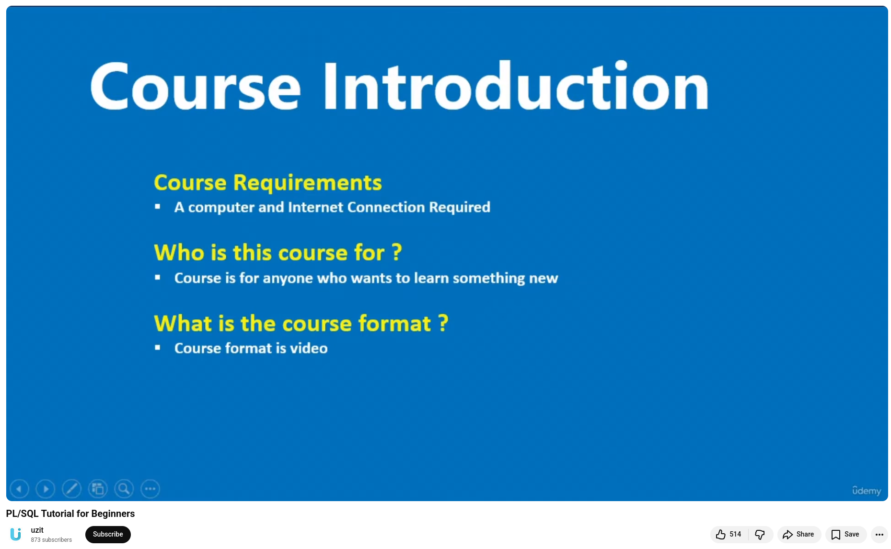

# PL/SQL Tutorial for Beginners

Quote from the course description:

In this PL/SQL tutorial for beginners, you'll learn: 
+ Create PL/SQL Blocks, 
+ Execute PL/SQL Blocks, 
+ Create PL/SQL Variables, 
+ Create PL/SQL Functions, 
+ Create PL/SQL Stored Procedures, 
+ Implement conditional statements, 
+ Create functions, 
+ Stored Procedures and build PL/SQL Program components, and more.

**PL/SQL is a combination of SQL along with the procedural features of programming languages.** It was developed by Oracle Corporation in the early 90's to enhance the capabilities of SQL. PL/SQL is one of three key programming languages embedded in the Oracle Database, along with SQL itself and Java. This tutorial will give you great understanding on PL/SQL to proceed with Oracle database and other advanced RDBMS concepts.

**This course is designed for Software Professionals**, who are willing to learn PL/SQL Programming Language in simple and easy steps. This tutorial will give you great understanding on PL/SQL Programming concepts, and after completing this course, you will be at an intermediate level of expertise from where you can take yourself to a higher level of expertise.

💡 **Before proceeding with this course**, you should have a basic understanding of software basic concepts like what is database, source code, text editor and execution of programs, etc. If you already have an understanding on SQL and other computer programming language, then it will be an added advantage to proceed.


## References
🔗 PL/SQL Tutorial for Beginners, [14th Feb 2023](https://www.youtube.com/watch?v=iY0akm4ejAY)


```
#Databases
#PLSQL
#Oracle
#PLSQLTutorial 
#SQL
```


