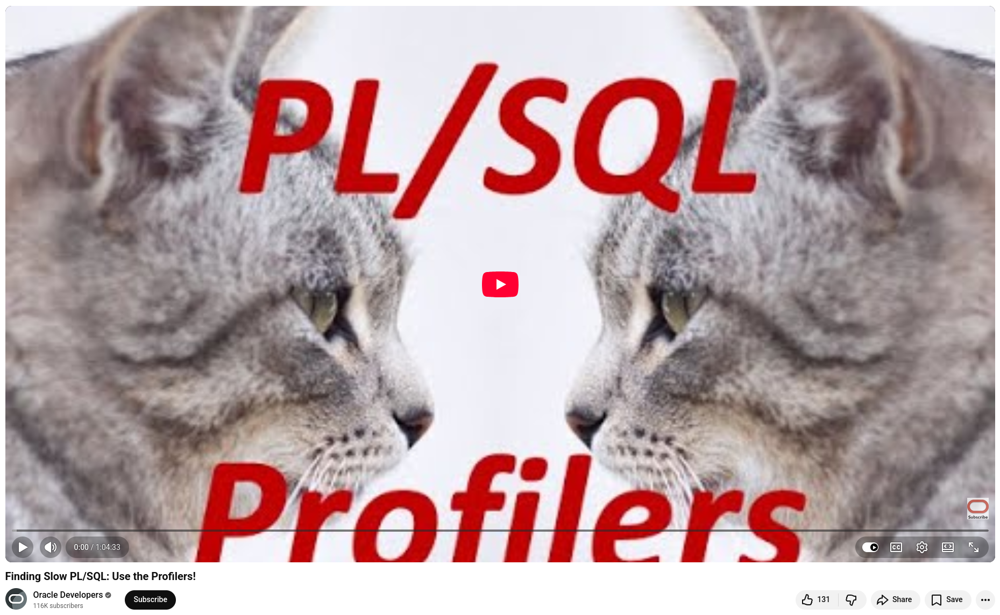

# Use the Profilers for PL/SQL

Performance issues in PL/SQL are inevitable. Your code passes unit testing and goes live, and then users start complaining. Sound familiar?

**Before scattering DBMS_OUTPUT statements** throughout your codebase or spending hours reading AWR reports, consider the two powerful profiling tools Oracle provides free of charge with no additional licensing required.

**The DBMS_PROFILER** has been available since Oracle 9 and operates at the line level. It tells you exactly how many times each line was executed, how much total time was spent, and the minimum and maximum execution times. This level of detail is invaluable. Within seconds of reading the output, you can identify a bottleneck, such as an UPDATE running 100 times inside a loop or a SELECT COUNT consuming over a minute of runtime, which might never surface in a high-level AWR report.

Introduced in Oracle 11g, **DBMS_HPROF (the Hierarchical Profiler)** complements DBMS_PROFILER by providing a higher-level, call-tree view. It is especially useful for handling nested subprogram calls, such as packages calling procedures calling functions. Importantly, DBMS_HPROF separates SQL and PL/SQL engine execution times, helping you identify excessive context switching, which is one of the most common causes of poor performance in PL/SQL code.

Both tools generate easy-to-read HTML reports. No special compilation is necessary. You only need a one-time EXECUTE grant, and no DBA privileges are required.

Key Takeaways for Performance Tuning:
+ **Don't over-optimize upfront.** Profile first, then fix what actually matters.
+ Loops and commits inside loops are frequent culprits.
+ Use DBMS_PROFILER for line-level analysis and DBMS_HPROF for call-tree analysis.
+ AWR provides a macro view, while profilers provide surgical precision.

💡 Your toolkit for slow PL/SQL: **AWR → Profiler → Execution Plans.** Master all three.


## References
+ Finding Slow PL/SQL: Use the Profilers!, [3rd Jun 2020](https://www.youtube.com/watch?v=SHO2iQIliFA)

```
#Oracle
#PLSQL
#PLSQLProfiling
#SQLOptimization
#OracleDeveloper
```




