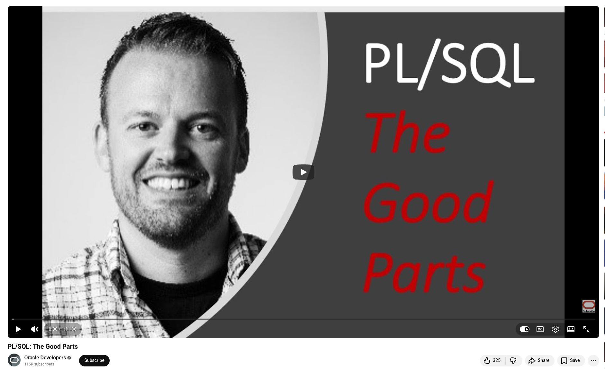

# PL/SQL: Still One of the Best Tools for Data-Centric Development

In a PL/SQL Office Hours session, consultant and Oracle veteran Morton Broughton revisited his popular talk, "PL/SQL: The Good Parts," offering a timely reminder of why this language deserves more respect.

**The language itself is underrated.** PL/SQL is simple and stable, and it evolves slowly. This means you spend less time chasing new features and more time solving real business problems.

**Packages are non-negotiable.** According to Morton's rule, never create standalone procedures or functions. Always use packages. Separating the specification from the implementation results in cleaner APIs, easier maintenance, and better code reuse.

**Small features, big impact.** Features like named parameters, default values, type anchoring (%TYPE, %ROWTYPE), and user-defined record types quietly make your code more readable, maintainable, and future-proof.

**Running inside the database is a superpower.** There is no connection management. No data type mapping. No boilerplate. Your logic lives alongside your data, which is both efficient and secure.

**Handle errors properly.** Use exceptions instead of return codes. Add logging to your code. Use autonomous transactions for audit trails. Always include the error stack in your logs.

The closing wisdom from Tom Kyte still holds: **do it in SQL first, then PL/SQL, and only then reach for another language.**

💡 Although PL/SQL isn't glamorous, it's an incredibly powerful tool for building robust, data-driven applications in the right hands.


## References
+ PL/SQL: The Good Parts, [1st Dec 2020](https://www.youtube.com/watch?v=59-9jLslPf0)


```
#PLSQL
#OracleDatabase
#SoftwareDevelopment
#BackendDevelopment
#DatabaseDevelopment
```


