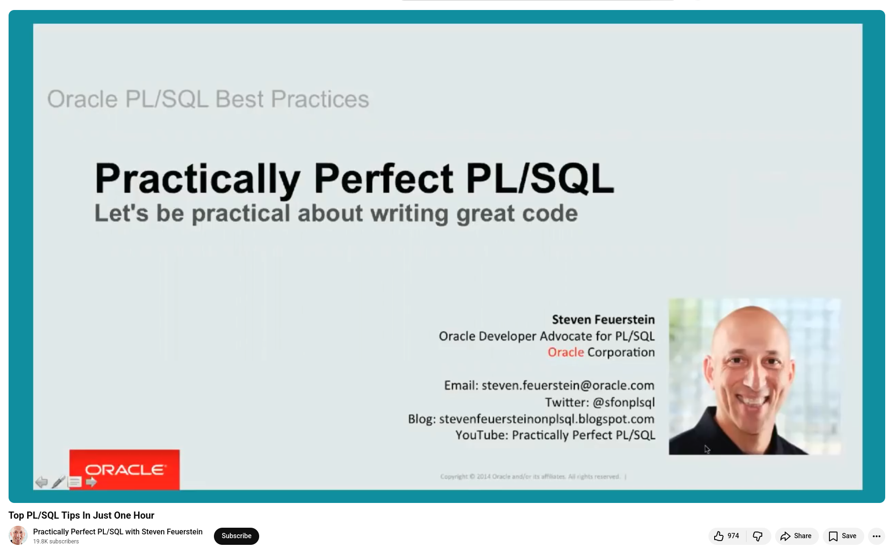

# Want to write better PL/SQL?


I recently watched Steven Feuerstein's session, "Top PL/SQL Tips in Just One Hour," and it was a masterclass in writing cleaner, faster, and more maintainable Oracle code.


**Enable Compiler Warnings.** Most developers disable this feature by default. You can turn it on with a simple ALTER SESSION SET PLSQL_WARNINGS statement. The compiler will flag unreachable code, missing return paths, and optimization hints that you would otherwise miss entirely. It also introduces you to features you may not know exist.

**Stop hard-coding.** VARCHAR2(100) declarations, repeated SQL statements, and business rules buried in logic are all forms of hard coding. Use %TYPE anchoring, subtypes, and data access layers (packages) to encapsulate your SQL and define a single point of truth. One change in one place. Every time.

**Keep executable sections small.** Any executable block of more than 50–60 lines is considered spaghetti code. Break the logic down into readable, named units using nested subprograms. Your future self and teammates will thank you.

**Eliminate row-by-row DML inside loops.** Row-by-row processing is slow. If you see DML inside a cursor loop, replace it with FORALL to enable bulk processing. You can achieve performance gains of an order of magnitude.

**Leverage the Function Result Cache.** One keyword, RESULT_CACHE, introduced in Oracle 11g, can dramatically reduce repeated query execution. Oracle automatically manages cache invalidation.

**Bonus.** Explore the NO COPY option for large OUT parameters and the UDF PRAGMA in 12c for frequently called SQL functions.


💡 These aren't just theoretical improvements. They're practical steps that can be taken without requesting new tools or management approval.

## References
🔗 Top PL/SQL Tips In Just One Hour, 14st Jul 2018, https://www.youtube.com/watch?v=vR8uDZ-u0aI


```
#Oracle
#PLSQL
#DatabaseDevelopment
#SQLOptimization
#OracleDeveloper
```


