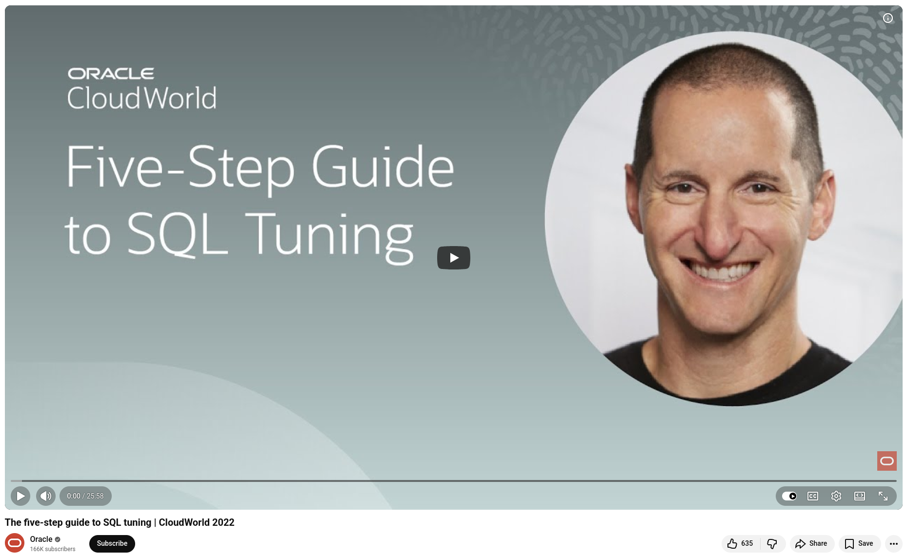

# The counterintuitive secret to SQL tuning

When a query that should run in milliseconds takes minutes (or even hours), we instinctively dive straight into the code. Parallelize it. Add an index. Rewrite the logic. However, as Connor illustrates with a compelling real-world example, this approach can lead to a rabbit hole of complexity, cost, and diminishing returns.

**Take a step back instead.** Talk to the business. Clarify the actual requirement. You may find, as his team did, that an existing, simpler data column solves the problem entirely.


Here's a quick summary of the five steps:
1. Don't optimize the SQL; **optimize the user experience.** Understand what's needed before writing a single line of code.

2. **Find problematic SQL the right way.** Use V$SQLSTATS over V$SQL to avoid latching issues that could further slow your system during the investigation process.

3. **Address the symptoms.** Use DBMS_XPLAN with GATHER_PLAN_STATISTICS to compare estimated versus actual row counts. A mismatch signals a bad plan. Use "cool" hints sparingly for triage, not as a permanent fix.

4. **Find the cure.** Consider using invisible indexes to reduce regression risk, extended statistics to improve optimizer decisions, or SQL Plan Management (SPM) to lock in the plans you trust.

5. **Celebrate!** If you've followed the first four steps, step five is simply basking in your users' praise.

💡 SQL tuning isn't a mystical art; it's a structured process. Watch Connor's full session to see these steps in action!


## References
+ The five-step guide to SQL tuning, [23th Nov 2022](https://www.youtube.com/watch?v=bV8SmHo9B3w)


```
#DatabaseOptimization
#SQLTuning
#Oracle
#SQLTutorial 
#SQL
```



