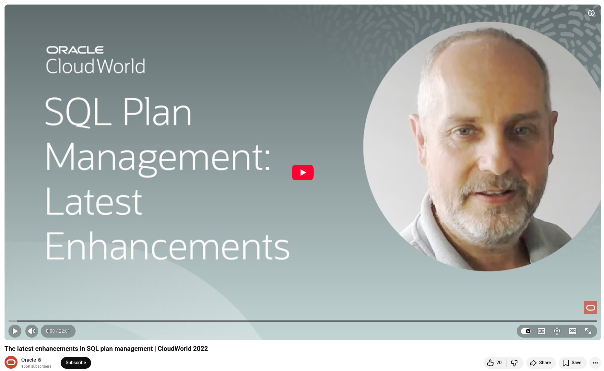

# SQL Plan Management

If you've ever received a page at 2 a.m. because a query plan changed and brought down a critical workflow, this one's for you.

Since 11g, **Oracle's SQL Plan Management (SPM)** has solved one of the most persistent headaches for DBAs: unexpected execution plan changes that silently degrade performance. The concept is straightforward: maintain a baseline of approved plans and prevent the optimizer from going rogue.

## But what about real evolution, like automation?

Here's what's changed from 19c to 23c:

**Oracle Database 19c — Automatic SPM (Autonomous & Exadata).** The database can now detect performance regressions on its own. Using the Automatic SQL Tuning Set, the database continuously tracks SQL execution history and plans. When a regression is detected, the Evolve Advisor wakes up in the background, tests previous plans, and reinstates the best one — all without human involvement.

**Oracle Database 23c — Foreground Detection.** This is where things get exciting! Instead of waiting for a background job to detect a problem, 23c brings the detection process to the forefront. This means that as soon as a query runs with a new plan, the database compares it to historical performance data. If the performance regresses, a SQL plan baseline is created on the spot. The next execution uses the better plan.

**Enterprise Edition users (non-Autonomous and non-Exadata)** can still enable the Automatic SQL Tuning Set and manually use the Evolve Advisor against problem statements, which is a significant improvement over starting from scratch.

💡 In short, we're shifting from reactive firefighting to self-healing query performance. It's worth exploring if query stability matters to your production workloads.

## References
+ The latest enhancements in SQL plan management, [23th Nov 2022](https://www.youtube.com/watch?v=5LJzKtWwhp4)

```
#Oracle
#SQL
#DatabasePerformance
#SQLPlanManagement 
#OracleDatabase
```


