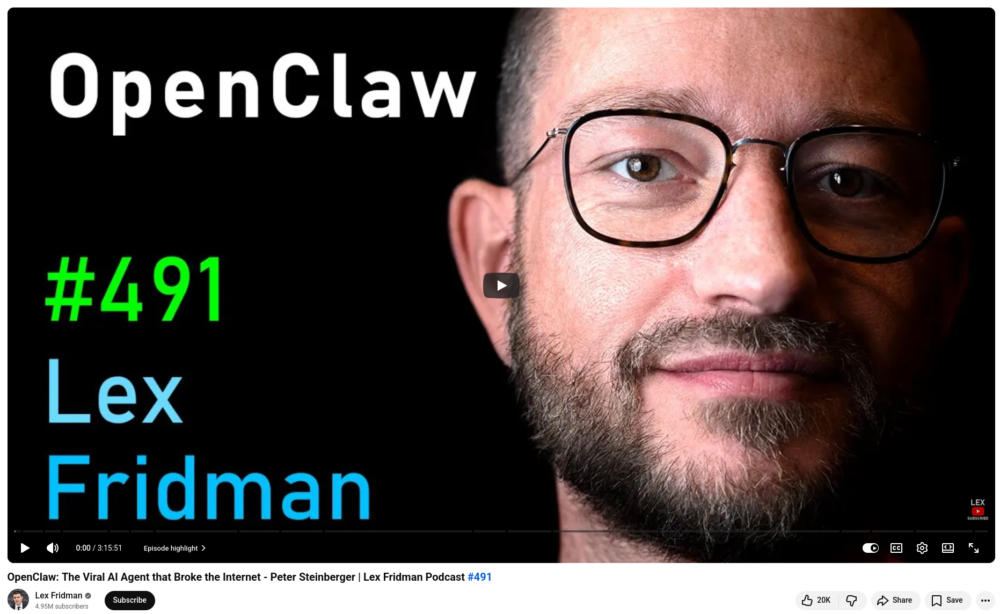

# OpenClaw: interview with Peter Steinberger

Peter Steinberger is the mind behind OpenClaw, an open-source AI agent framework that has emerged as the fastest-growing project in GitHub's extensive history.


## References
+ OpenClaw: The Viral AI Agent that Broke the Internet - Peter Steinberger | Lex Fridman Podcast, [12th Feb 2026](https://www.youtube.com/watch?v=YFjfBk8HI5o)

```
#OpenClaw
#AIAgents
#OpenSource
#AIInnovation
#FutureOfAI
```


