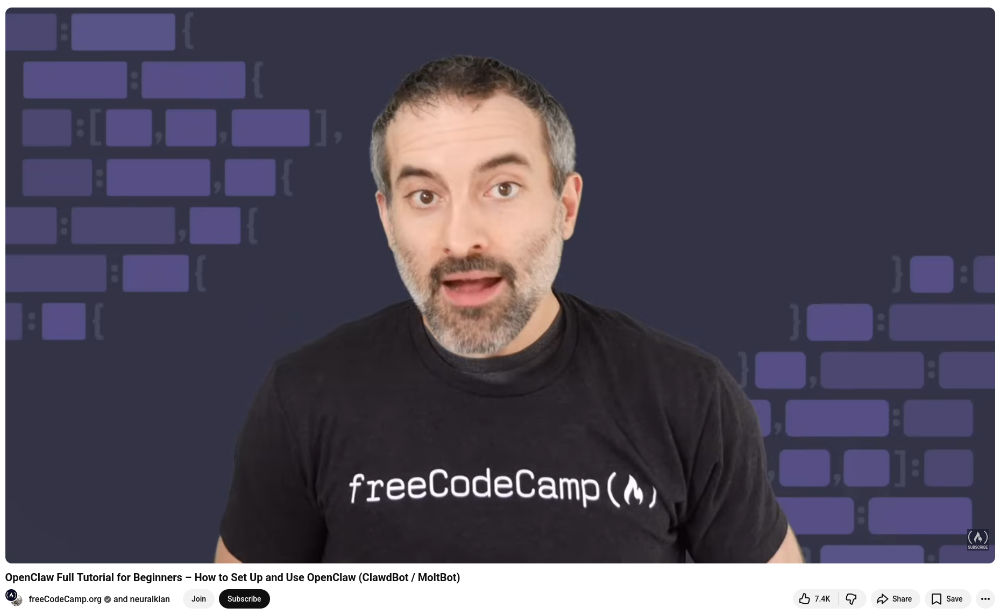

# OpenClaw Full Tutorial for Beginners

This course provides a comprehensive introduction to OpenClaw, a proactive, autonomous agent and messaging gateway. With OpenClaw, you can automate digital tasks through platforms such as WhatsApp, Telegram, and Discord. 

Kian will lead the course. The modules cover topics ranging from local installation and connecting leading AI models to managing persistent long-term memory and expanding agent capabilities with specialized skills. 

You will also learn essential security measures, such as using Docker-based sandboxing to protect your host system while your agent performs real-world workflows.


## References
+ OpenClaw Full Tutorial for Beginners – How to Set Up and Use OpenClaw, [4th Feb 2026](https://www.youtube.com/watch?v=n1sfrc-RjyM)

```
#OpenClaw
#AIAgents
#OpenSource
#AIInnovation
#FutureOfAI
```


