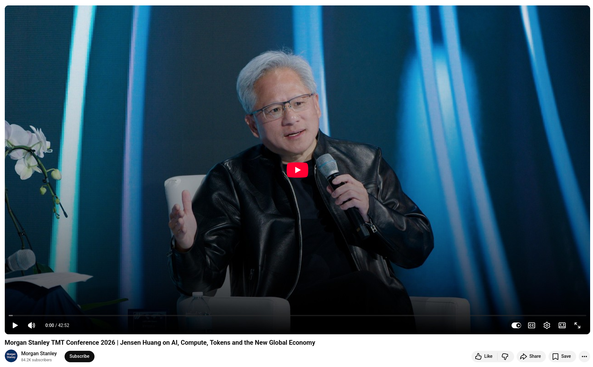

# Jensen Huang on AI, Compute, Tokens and the New Global Economy

Watch as NVIDIA CEO Jensen Huang explains how AI is reshaping the global economy at the Morgan Stanley Technology, Media & Telecom Conference in San Francisco. 

**His core insight is that:** Computing creates tokens, tokens power intelligence, and intelligence translates into economic output at every level, from companies to countries. 

## Reference
+ Morgan Stanley TMT Conference 2026 | Jensen Huang on AI, Compute, Tokens and the New Global Economy, [18th Mar 2026](https://www.youtube.com/watch?v=xv7UVAfyebk)

``
#AI
#NVIDIA
#JensenHuang
#GlobalEconomy
#DigitalTransformation
``

