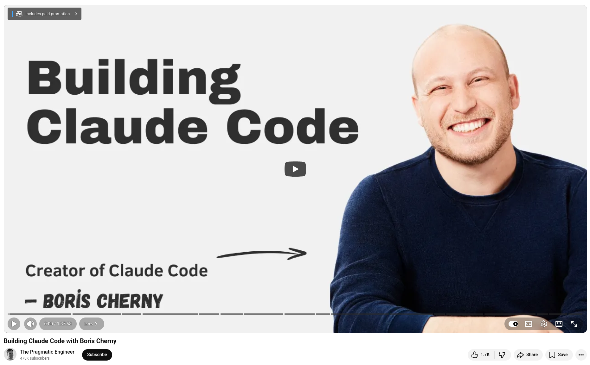

# Building Claude Code with Boris Cherny


Boris, the creator of Claude Code and author of Programming TypeScript, recently sat down with The Pragmatic Engineer to discuss how his terminal side project became one of the industry's fastest-growing developer tools. Whether you're a skeptic or a true believer, the conversation is worth your time.

**The architecture is simpler than you would expect.** There are no complex RAG pipelines or elaborate vector databases. Claude Code opted for agentic search, essentially glob and grep, because it outperformed every fancier retrieval approach they tried. The lesson is to resist the temptation to over-engineer. Let the model do its thing.

**Code quality continues to improve.** Before joining Anthropic, Boris led code quality across all of Meta. He observed that clean, fully migrated codebases make engineers more productive, and this turns out to apply equally to models. An unfinished migration confuses LLMs the same way it confuses new hires. Technical debt is no longer just a human problem.

**The verification layer is more important now than ever before.** At Anthropic, Claude Code reviews every pull request (PR), catching roughly 80% of bugs. However, it runs alongside type checkers, linters, and human review, not instead of them. Deterministic tools and nondeterministic models complement each other.

**The printing press analogy is worth serious consideration.** Medieval scribes were a small elite group employed by kings who couldn't write themselves. Coding is similar in that it is a rare skill that gives us enormous leverage. The printing press didn't eliminate writers; rather, it expanded the market for written work exponentially. Boris argues that we are at that inflection point now.

💡 On average, Claude Code now writes approximately 80% of the code at Anthropic. Meanwhile, Boris ships 20–30 pull requests daily without editing a single line by hand.

💡 The question isn't whether these changes alter our role. Rather, it's about whether we're willing to adapt as quickly as the tools.


## References
+ Claude Code by Anthropic, [March 2026](https://claude.com/product/claude-code)
+ Building Claude Code with Boris Cherny, [4th March 2026](https://www.youtube.com/watch?v=julbw1JuAz0)


```
#ClaudeCode
#AgenticCoding
#Anthropic
#AI 
#SoftwareEngineering
```



