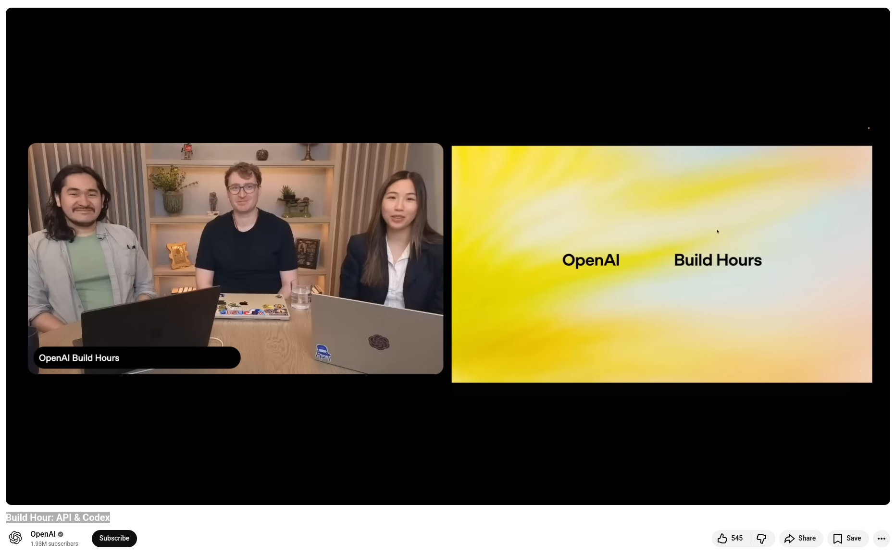

# Codex, OpenAI: Agentic Delegation


Use Codex and OpenAI APIs to build agent-powered workflows for real engineering work. During this Build Hour, you will learn how teams are transitioning from pair programming to agentic delegation. In this model, AI systems can independently perform entire engineering tasks, from planning to execution. 


## References
+ Build Hour: API & Codex, OpenAI [10th March 2026](https://www.youtube.com/watch?v=rhsSqr0jdFw)


```
#Codex
#AgenticCoding
#OpenAI
#AI 
#SoftwareEngineering
```



