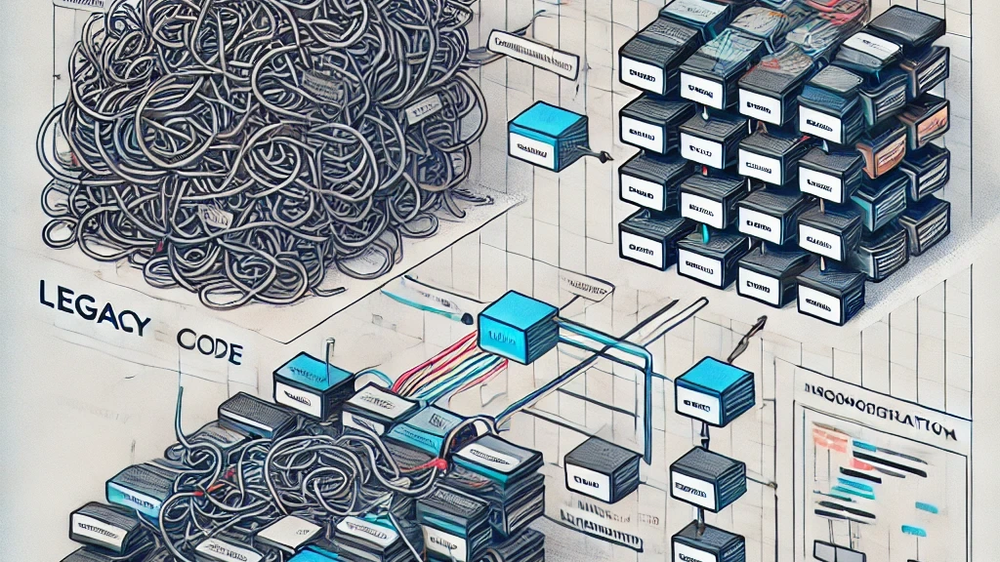

# Legacy Codebase Isn't Doomed

I've seen it countless times in C++ shops: a 3,000,000-line monolith, no meaningful documentation, original authors long gone, and a #include chain that could wrap the globe twice. That's not technical debt. That's legacy code, and it's more common than anyone admits.

The good news? There's a proven path forward: **modularization**.

## What modularization actually means (and doesn't mean)
It's not a rewrite.
It's not a new parallel system.
It's a disciplined, incremental transformation of your existing codebase into a set of libraries with clean interfaces and directed dependencies: no cycles, no hidden global state, no spaghetti.
The dependency graph becomes your north star. If your libraries form a DAG (directed acyclic graph), you're on the right track. If you spot cycles, stop. Those cycles are your biggest maintenance liability.

## Why it matters — especially in C++
In C++, poorly scoped #include directives don't just cause logical coupling. They cause compilation coupling. Changing one header can trigger cascading rebuilds across dozens of translation units.
Modularization eliminates those unnecessary preprocessor dependencies. The payoff is real:
🔹 Dramatically faster build times
🔹 Testable, isolated components
🔹 Clear ownership boundaries for your teams
🔹 Faster onboarding for new engineers
🔹 The ability to sell or license subsystems independently

## The rule that makes modularization safe
The system must have identical observable behavior before and after modularization. 
No refactoring. 
No interface changes. 
No "while I'm in here" improvements.
Separate the restructuring from the redesign.
Do one, verify it, then do the other.
This discipline is what separates a successful modularization from one that introduces subtle regressions nobody notices for six months.

## Where to start?
Begin with the most leaf-level classes: those that depend on nothing else.
Extract them into a library.
Integrate it. 
Verify. 
Then work upward through the dependency tree, one layer at a time.
Slow? Yes.
Boring? Often. 
But this incremental, systematic approach is what keeps the system releasable throughout the entire process.

💡 If you're staring down a legacy C++ system that feels impossible to change, modularization is not a moonshot. It's engineering. It takes patience, a clear graph, and the discipline to resist the urge to fix everything at once.


 

## References
+ Z. Romanowski, Modularization of legacy code, [2021](https://www.linkedin.com/pulse/modularization-legacy-code-zbigniew-romanowski)
+ M. Fowler, Refactoring: Improving the Design of Existing Code, [2018](https://martinfowler.com/books/refactoring.html)


```
#Cpp
#SoftwareEngineering
#LegacyCode
#Refactoring
#CleanCode
```




