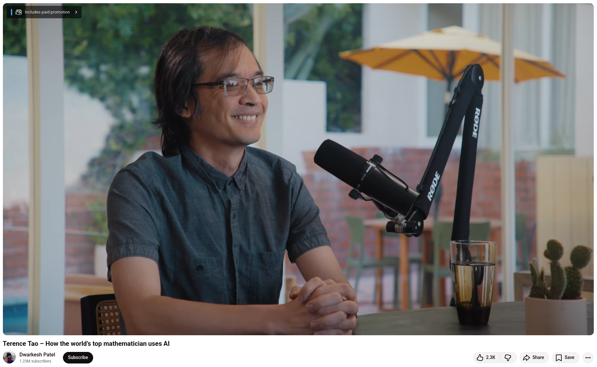

# AI and Math: interview with Terence Tao

## Timestamps (copier from reference)

+ 00:00:00 – Kepler was a high temperature LLM
+ 00:11:44 – How would we know if there’s a new unifying concept within heaps of AI slop?
+ 00:26:10 – The deductive overhang
+ 00:30:31 – Selection bias in reported AI discoveries
+ 00:46:43 – AI makes papers richer and broader, but not deeper
+ 00:53:00 – If AI solves a problem, can humans get understanding out of it?
+ 00:59:20 – We need a semi-formal language for the way that scientists actually talk to each other
+ 01:09:48 – How Terry uses his time
+ 01:17:05 – Human-AI hybrids will dominate math for a lot longer

## References
+ Terence Tao – How the world’s top mathematician uses AI, [20th Mar 22026](https://www.youtube.com/watch?v=Q8Fkpi18QXU)


```
#AI
#Math
#Research
#Tao
```




