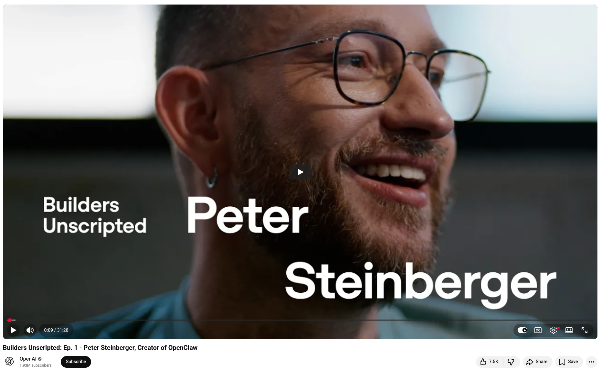

# OpenClaw's author joined OpenAI

What happens when an exhausted founder rediscovers his passion for building and AI comes along at just the right time?

## That's Peter Steinberger's story

After 13 years, Peter stepped away from running PSPDFKit. There was no grand plan. He just wanted to rest. But when he finally felt ready to build again, he picked up Agentic tools, and everything changed.

**OpenClaw didn't originate in a boardroom.** It was born out of curiosity, a trip to Marrakesh, and a voice message that "shouldn't have worked." Nevertheless, the model figured it out by inspecting file headers, running FFmpeg, finding an API key in the environment, and transcribing the audio independently. That moment crystallized what was now possible.

Just a few weeks later, an experiment on Discord evolved into ClawCon, a community-organized event that drew nearly 1,000 people to San Francisco and hundreds more to Vienna. In just one month, the project had become a global phenomenon.

What advice does Peter have for developers who are hesitant to embrace agentic tools?
"Approach it playfully. Build something you've always wanted to build."

He also pushes back on the "vibe coding" label. **Effectively using AI is a skill that improves over time.** Those who will thrive aren't the ones who resist the shift. Rather, they are the ones who learn to think alongside these tools.

💡 In his words, "You won't be replaced by AI." You'll be replaced by someone who uses it better."

## References
+ Builders Unscripted: Ep. 1 - Peter Steinberger, Creator of OpenClaw, [24th Feb 2026](https://www.youtube.com/watch?v=9jgcT0Fqt7U&t=9s)


```
#OpenClaw
#AIAgents
#AITools 
#Innovation
#SoftwareDevelopment
```





