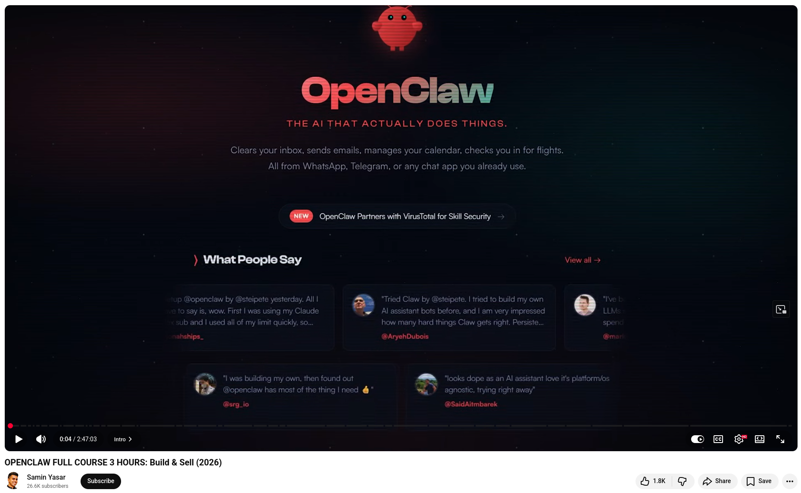

# OpenClaw Practical Course


Samin Yasar just released a free, three-hour OpenClaw course, and it's one of the most practical AI resources I've seen.

He uses OpenClaw every day to run his business, including managing content pipelines, handling community management, negotiating sponsorships, and automating stock trading. After spending hundreds of hours building and selling these systems, he consolidated them into one resource.

## Here's what the course covers:

**Setup**: From scratch installation; Discord/Telegram integration; Memory graphs via Obsidian; Mission control dashboards; Security hardening across 10 common vulnerabilities.

**Core concepts**: Skills, MCPs, cron jobs, sub-agents, agentic workflows, and how they connect into systems that run without you.

**Real builds**: Morning briefing agent, script-to-slides generator, Instagram carousel creator, motion graphics, trading bot, community manager, VisionClaw.

**How to sell**: Exact pricing structures, offer frameworks, and a real interview with a community member.

💡 The current shift mirrors the early eras of the internet and smartphones. Those who learned early on built real businesses. The same opportunity is available now.

💡 Execution is becoming commoditized. System design is the new bottleneck. That's where your value lies.


## References
+ OPENCLAW FULL COURSE 3 HOURS: Build & Sell (2026), [16th Mar 2026](https://www.youtube.com/watch?v=rv6p9R_lNxc)


```
#OpenClaw
#AIAgents
#AITools 
#Innovation
#SoftwareDevelopment
```


