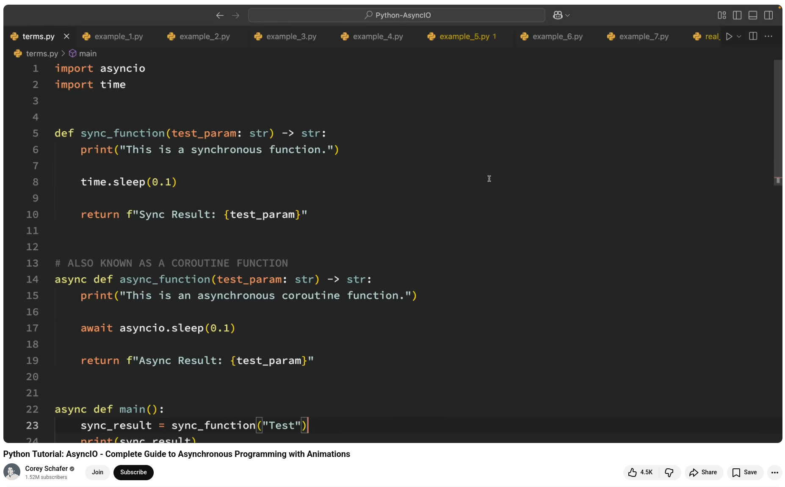

# AsyncIO Python Tutorial


I recently worked through Corey Schafer's Python AsyncIO: Complete Guide to Asynchronous Programming, and it's one of the most thorough technical tutorials for Python developers of any level that I've come across.


## Here's what stood out:


**The visualizations changed everything.** Corey created custom animations that show exactly how the event loop manages coroutines and tasks in real time. If you've ever looked at async/await syntax and felt confused, these animations are exactly what you need.


**The real-world benchmark is eye-opening.** A synchronous image downloader and processor that took ~23 seconds to finish was refactored step by step until it finished in under 5 seconds. This was not done by guessing, but rather by first profiling with Scalene to identify what was I/O-bound versus CPU-bound, and then applying the right tool: AsyncIO with HTTPX was used for downloads and multiprocessing was used for image processing.


**The decision framework is practical:**

+ I/O-bound + async library available → asyncio
+ I/O-bound + no async alternative → threads
+ CPU-bound → multiprocessing


💡 The tutorial also covers semaphores for rate limiting, TaskGroup versus gather, pitfalls of blocking code, and asynchronous context managers. These are all things that you will quickly encounter in production code.


## References

+ Python Tutorial: AsyncIO - Complete Guide to Asynchronous Programming with Animations by Corey Schafer, [20th August 2025](https://www.youtube.com/watch?v=oAkLSJNr5zY)


```
#Python
#AsyncIO
#AsynchronousProgramming
#Concurrency
#Multithreading
```


