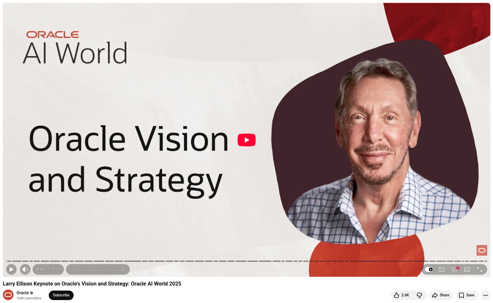

# Oracle's Vision and Strategy

At Oracle's recent keynote, Larry Ellison boldly claimed, "AI changes everything." After hearing his vision, it's difficult to disagree.

**Ellison outlined the two defining phases of the AI era.** The first is the race to build massive multimodal models—systems that see, hear, reason, and learn much like the human brain, but with 1.2 billion watts of power instead of 20. The second, far more consequential phase involves deploying these models to solve humanity's hardest problems.

**Private data is the unlock.** Although public AI models are trained on internet data, the world's most valuable data sits in private databases. Oracle's AI Data Platform uses RAG (retrieval-augmented generation) to enable organizations to reason securely across their own private data without ever exposing it. This is where real enterprise value is created.

**Healthcare is the proving ground.** Oracle isn't just modernizing hospital software; it's automating entire care ecosystems. The ambition is striking, from AI-assisted clinical decisions and reimbursement matching to drone-delivered lab samples and metagenomic sensors capable of detecting novel pathogens before they become pandemics.

**AI agents are the new workflows.** Instead of writing software, Oracle now generates AI agents based on intent. These agents are stateless, secure, and scalable by design. What once required years of development can now be described in plain language and deployed in days.

**Ellison's message was optimistic yet realistic.** AI won't replace us; it will enable us to become dramatically better at what we do. Better doctors. Better engineers. It will lead to better outcomes for patients, organizations, and the planet.


💡 The question is no longer if AI will transform industries. The question is whether your organization is building the infrastructure to lead the transformation or simply watch it happen.


## References
+ Larry Ellison Keynote on Oracle's Vision and Strategy: Oracle AI World 2025, [14th Oct 2025](https://www.youtube.com/watch?v=4eCFmbX5rAQ)

```
#AI
#Oracle
#EnterpriseAI
#HealthcareAI
#Innovation
```



