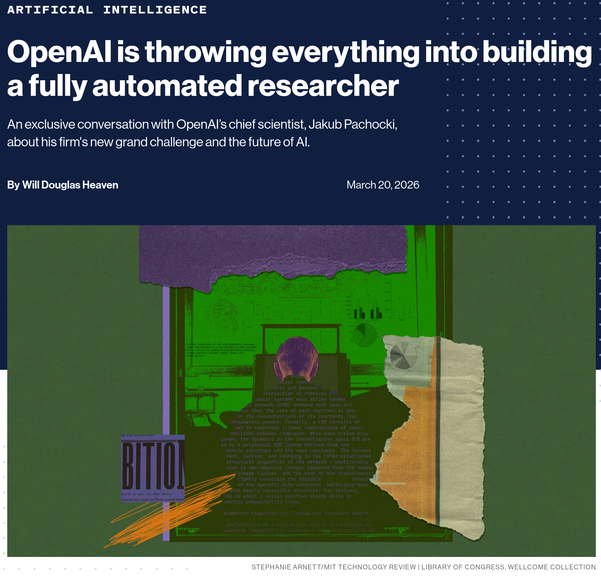

# OpenAI's Next Moonshot: A Fully Automated AI Researcher

OpenAI just announced its ambitious new "North Star."

In an exclusive interview with MIT Technology Review, **OpenAI Chief Scientist Jakub Pachocki** presented a bold plan: to have an autonomous AI research intern in place by September 2026 and a fully automated, multi-agent research system capable of tackling problems too large or complex for humans alone by 2028.

Consider new mathematical proofs. Breakthroughs in biology and chemistry. Solutions to policy challenges on a large scale.

As a developer, I find the technical trajectory fascinating. It runs through reasoning models, extended context management, and multi-agent orchestration, building on the capabilities of tools like Codex for code and applying them across all of science. As Pachocki puts it, if it can solve coding problems, then it can solve any problem that can be expressed in text, code, or equations.

## A few things stood out to me beyond the headline

+ **Oversight is still unsolved.** Chain-of-thought monitoring is promising, but Pachocki openly admits it's far from sufficient for truly autonomous systems.
+ **The risk of power concentration is real.** "Imagine a data center doing the work of an entire organization." Those are his words, not a critic's.
+ **Responsible deployment is more important than speed.** Sandboxing, policy development, and interpretability research must keep pace with advances in capability.

💡 OpenAI's ambitions are extraordinary!


## References
+ "OpenAI is throwing everything into building a fully automated researcher" by Will Douglas Heaven, [20th March 2026](https://www.technologyreview.com/2026/03/20/1134438/openai-is-throwing-everything-into-building-a-fully-automated-researcher)


```
#ArtificialIntelligence
#MachineLearning
#AIResearch
#SoftwareDevelopment
#FutureOfWork
```


