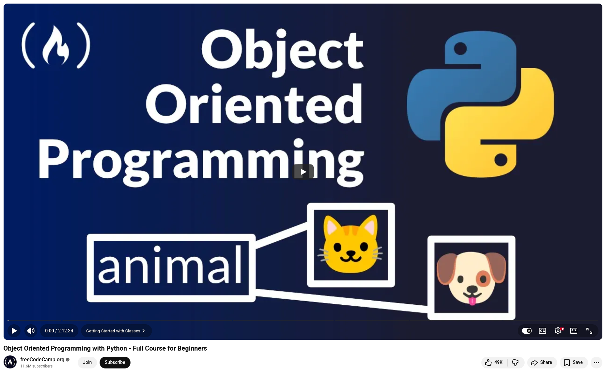

# Object Oriented Programming with Python

Object-oriented programming (OOP) is one of those concepts that separates good developers from great ones. However, it is also one of the most misunderstood topics among beginners and intermediate developers.

**The "aha" moment begins with classes.** Instead of juggling four loosely related variables, you create your own data types—objects with attributes and behaviors that belong together.

**Constructors (__init__) are your best friend.** They enforce structure when objects are created, so you always know what attributes an instance should have.

**The difference between class and instance attributes** is more important than you think. Want to apply a store-wide discount? That's a class attribute. Do you want a specific item to have a custom discount? Override it at the instance level.

**Class and static methods serve different purposes.** Use class methods to instantiate objects from structured data, such as CSV or JSON. Use static methods for utility logic related to your class that doesn't depend on instance or class state.

**Inheritance and polymorphism lead to scalable code.** First, build a parent Item class. Then, extend it with Phone, Laptop, and Keyboard, each of which inherits shared logic while maintaining its own behavior.

💡 In summary, encapsulation and abstraction help you write clean, intentional code that can be maintained at scale.


## References
+ Python Object Oriented Programming (OOP) - Full Course for Beginners, [29 Jan 2025](https://www.youtube.com/watch?v=iLRZi0Gu8Go)
+ Object Oriented Programming with Python - Full Course for Beginners, [13 Oct 2021](https://www.youtube.com/watch?v=Ej_02ICOIgs)


```
#Python
#ObjectOrientedProgramming
#SoftwareDevelopment
#CodingForBeginners
#ProgrammingTips
```


