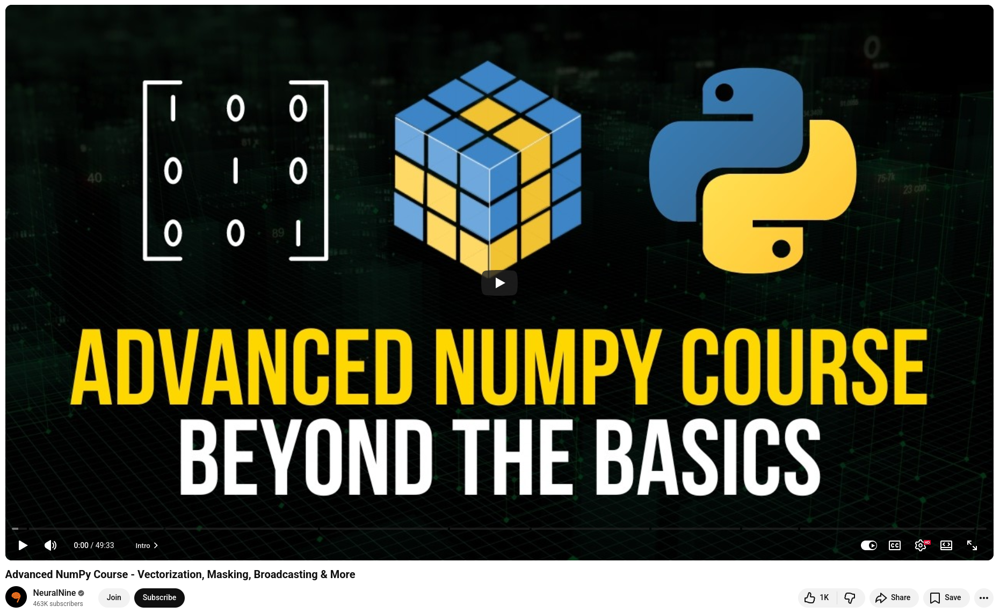

# Python NumPy Tutorials

If you're a Python developer who hasn't fully explored NumPy, you're probably missing out on significant performance gains.

NumPy (Numerical Python) forms the **foundation of scientific computing in Python**. At its core, NumPy introduces the array, which is a fast, memory-efficient n-dimensional array that can replace slow Python lists for numerical operations.

Here's why it matters in production:

**Speed.** Vectorized operations run in optimized C behind the scenes and are often 50–100 times faster than equivalent Python loops.

**Interoperability.** Pandas, TensorFlow, PyTorch, and Scikit-learn are all based on NumPy arrays. They are the common language of the data ecosystem.

**Expressiveness.** With broadcasting, you can write clean, concise math across arrays of different shapes without using a single loop.

💡 No matter what you're doing — whether it's building machine learning pipelines, processing financial data, or performing signal analysis — NumPy is almost always essential.

💡 If you're new to this, start with NumPy arrays, broadcasting, and vectorization. Mastering these three concepts will transform the way you write numerical code.

 

## References
+ Python NumPy Tutorial for Beginners, [7 Aug 2019](https://www.youtube.com/watch?v=QUT1VHiLmmI)
+ Learn NumPy in 1 Hour (Beginner Tutorial), [8 Nov 2025](https://www.youtube.com/watch?v=8h46xOkWVtI)
+ Learn NumPy in 40 Minutes - Python NumPy Tutorial, [15 Jan 2026](https://www.youtube.com/watch?v=zI5ducyfyNc)
+ NumPy Tutorial: For Physicists, Engineers, and Mathematicians, [10 May 2021](https://www.youtube.com/watch?v=DcfYgePyedM)
+ Advanced NumPy Course - Vectorization, Masking, Broadcasting & More, [9 Sep 2024](https://www.youtube.com/watch?v=pQt8yQuPOGo)


```
#Python
#NumPy
#PythonTutorial
#SoftwareDevelopment
#ProgrammingTips
```


