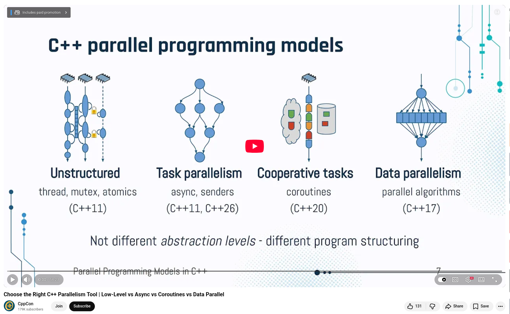

# Choosing the Right C++ Parallelism Tool

At CppCon 2025, Eran Gilad gave a presentation on one of the most common sources of confusion in modern C++ development: the vast number of available parallel programming features.
The key takeaway? These features aren't just different abstraction levels. Instead, they belong to four distinct programming models, each suited to a different problem structure.

## Unstructured Parallelism (Low-Level)

It is built on C++11 primitives, including threads, atomics, mutexes, and semaphores. It offers maximum control and maximum risk. It is best used to construct higher-level facilities, such as thread pools, concurrent data structures, and long-running background services. The lower you go, the more expertise you need.

## Task Parallelism (Async)

Since C++11, std::async has been the primary tool for representing independent units of computation with inputs and outputs — and, crucially, no side effects. However, its limitations (no composition and no scheduling control) are significant. C++26's senders/receivers will be a game-changer by enabling composable task graphs, flexible schedulers, and built-in cancellation.

## Cooperative Multitasking (Coroutines)

Coroutines shine when you have far more tasks than cores and tasks that can block. Introduced in C++20, they enable context switching at the user level without the involvement of the operating system (OS). However, the standard doesn't provide a scheduler, so you need a runtime that pairs coroutine suspension with asynchronous I/O awareness. Native synchronization primitives like std::mutex can be problematic here.

## Data Parallelism (Parallel Algorithms)

For massively uniform data processing, C++17's parallel algorithms offer a high-safety, declarative API with execution policies ranging from sequential to SIMD-friendly parallel_unsequenced. They provide low control but enormous optimization potential for runtimes, including the potential for GPU execution.


💡 Gilad's framework is a practical lens for making architectural decisions — not just understanding individual features in isolation.


## References
🔗 Choose the Right C++ Parallelism Tool | Low-Level vs Async vs Coroutines vs Data Parallel, CppCon 2025, https://www.youtube.com/watch?v=7a9AP4rD08M


```
#CPlusPlus
#CppCon
#ParallelProgramming
#Coroutines
#Concurrency
```



