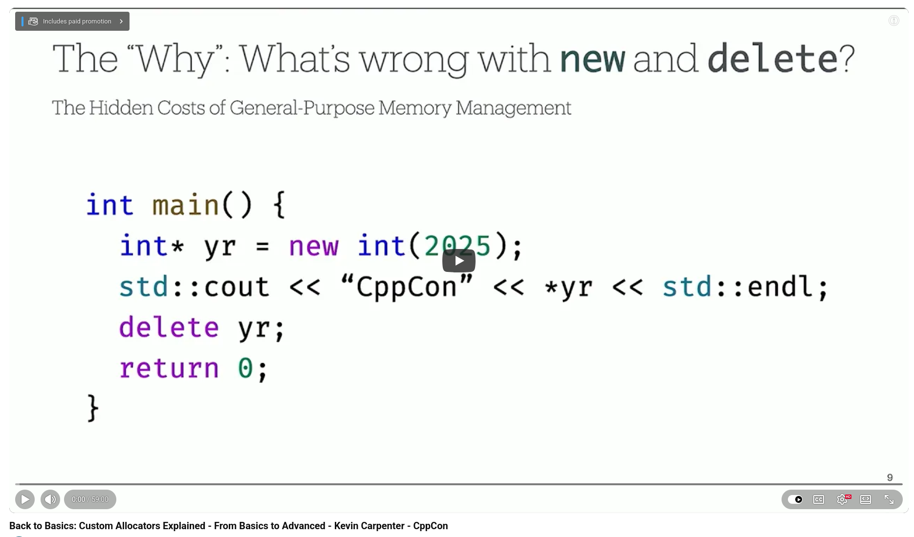

# C++ Custom Allocators Explained, CppCon 2025

At CppCon 2025, Kevin Carpenter delivered an accessible talk on the challenging topic of custom memory allocators in C++. What was his goal? He wanted to show that this subject isn't just for advanced users, and he largely succeeded.


## The Problem with Default Memory Management

Carpenter started by asking a question that many C++ developers overlook. What is actually wrong with new and delete? The answer is more nuanced than most people realize. A single new call can trigger a context switch, a kernel request, memory mapping, and another context switch before your object is constructed. Beyond raw latency, fragmented heap allocations destroy cache locality, turning fast data access into a cascade of misses in the L1, L2, and main memories.


## Two Allocator Patterns Worth Knowing

+ The **pool allocator** allocates a large block of memory upfront and manages fixed-size objects using an intrusive linked list. It provides constant-time allocation, zero fragmentation, and reusable objects without repeated heap requests. Carpenter uses this pattern in production to process high-frequency credit card transactions, for which throughput and predictable latency are essential.

+ The **stack allocator** sequentially allocates memory using a pointer offset. It supports mixed types and offers the fastest allocation once memory has been acquired. It also enables bulk deallocation via checkpoints. These features make it ideal for scratchpad memory, game engine frames, and short-lived data.


## The std::allocator Contract

He also demystified the standard allocator model, demonstrating that compliance only requires a value_type and functions for allocating and deallocating memory. Since allocator_traits handles the rest, writing a custom allocator that conforms to the standard is easier than most people expect.

## The Practical Takeaway

Carpenter's closing advice was practical: first, rely on modern C++ and the STL (the 80/20 rule applies). However, when building trading systems, game engines, or embedded applications where every microsecond counts, understanding allocator patterns at a foundational level is what separates good engineers from great ones.


💡 "Profile twice. The default allocator is a generalist. You're the specialist."


## References
🔗 Back to Basics: Custom Allocators Explained - From Basics to Advanced - Kevin Carpenter, CppCon 2025, [13 Feb 2026](https://www.youtube.com/watch?v=RpD-0oqGEzE)


```
#CPlusPlus
#CppCon2025
#SoftwareEngineering
#PerformanceEngineering
#MemoryManagement
```



