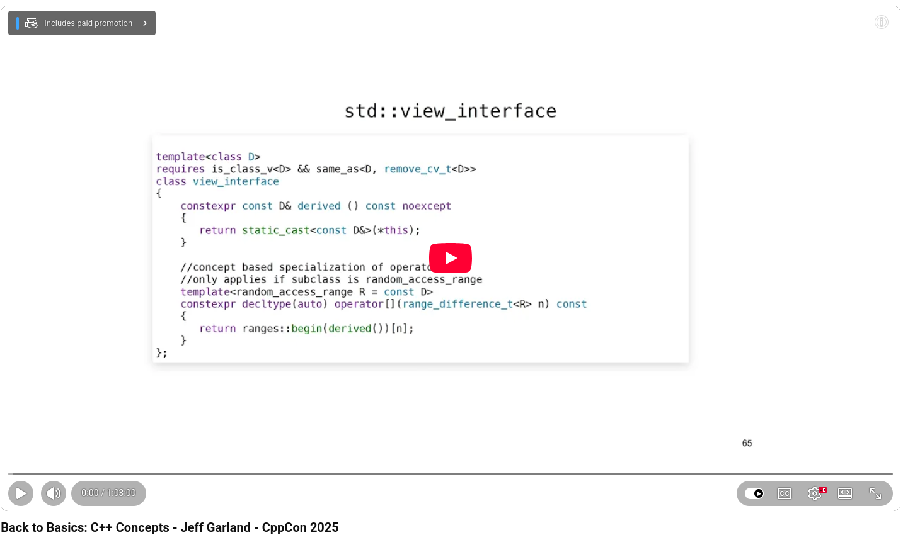

# C++ Concepts: The Fundamental Shift

After years of template metaprogramming hacks and cryptic error messages, C++20 finally delivered what we had been waiting decades for: first-class language concepts. At CppCon 2025, Jeff Garland gave a presentation explaining why this feature is more than just syntactic sugar. It represents a fundamental shift in how we design and communicate C++ code.


## What are concepts, really?

At their core, concepts are boolean predicates on types that are evaluated entirely at compile time. There is no runtime cost. There is no linker footprint. They offer pure expressiveness with zero performance trade-off. They allow us to specify what a type must be able to do rather than just what type it must be.


## The practical impact is immediate.

The "requires" keyword and the "ConceptName auto" pattern open up possibilities that were previously reserved for expert template metaprogrammers. Now, even junior engineers can write constrained templates that are readable, safe, and self-documenting. Garland's team has been using concepts in production for five years and reports that, once developers adopt them, they never go back.


## Three capabilities that stand out:
+ Constrained variables and return types detect breaking changes at compile time, which an unconstrained auto would miss. For example, a return type changing from int to long might slip through, but a concept like TimeDuration ensures that the contract is preserved.
  
+ Improved error messages transform template failures from incomprehensible noise spanning multiple pages into clear, actionable diagnostics that point directly to the unsatisfied constraint.
  
+ Design-level abstraction allows you to depend on a concept rather than a specific type, breaking rigid type dependencies while retaining full compiler enforcement.


## The standard library is already there.

The C++20 standard library is deeply integrated with concepts, including ranges, comparability, regularity, and construction semantics. Passing std::ranges::range as a function parameter allows your algorithm to work with vectors, arrays, spans, and generator views without any overloads.

Garland's closing thought resonated: the biggest promise of concepts isn't clever metaprogramming. It's writing code that clearly communicates to the humans who will read it next.


💡 If you haven't explored C++20 concepts yet, now is the time. The compiler support is mature, the standard library leads by example, and the learning curve is far gentler than its reputation suggests.


## References
+ Back to Basics: C++ Concepts - Jeff Garland, CppCon 2025, [16 Feb 2026](https://www.youtube.com/watch?v=NpuNUGifL1M)


```
#CPlusPlus
#CppCon2025
#ModernCpp
#CppTemplates 
#Cpp20
```



