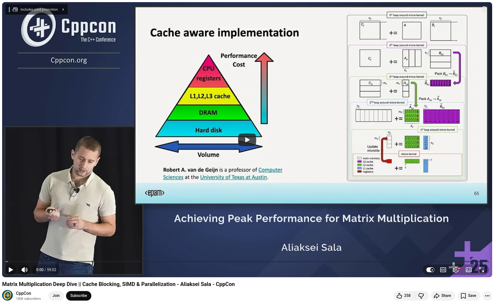

# Matrix Multiplication Deep Dive


At CppCon 2025, Aliaksei Sala, a lead software engineer with over ten years of experience in C++, took us on a remarkable journey from a naive matrix multiplication implementation to one that rivals and even surpasses OpenBLAS on certain hardware.

The motivation is clear: 70–90% of transformer computing power is spent on matrix multiplication. With AI computing requirements doubling every four months, maximizing the performance of hardware isn't just academic — it's essential.

## Here's the progression Aliaksei walked through:

**Starting point**: A triple-nested loop. 152 seconds.

**Loop reordering (i→k→j)**: A simple change to improve cache access patterns delivered a 12.6× speedup. No new instructions. Just respecting how memory works.

**Cache blocking / tiling**: Dividing matrices into blocks to maximize data reuse tripled performance again. The key insight: match tile sizes to your L1/L2 cache hierarchy — not arbitrarily, but by reasoning about what data gets reused and how frequently.

**Manual SIMD vectorization**: The compiler had already auto-vectorized, but manual intrinsics exposed something telling — the compiler left registers on the table. Using all 16 YMM registers available on the target CPU pushed performance further.

**Cache-aware implementation**: Aligning tile sizes to the full memory hierarchy (L1 → L2 → L3) added another 1.16× gain.

**Multi-threading**: Splitting work across 4 cores delivered a 3× improvement. Straightforward, but only after the single-threaded kernel was already well-optimized.

**Tiled matrix layout + prefetching**: Reorganizing memory access patterns to eliminate strided reads, combined with selective prefetching of matrix C, closed the remaining gap.

**The final result**: On an AMD Zen 5 (9950X), Aliaksei's implementation outperformed OpenBLAS for doubles — and achieved 3.09 teraflops on bfloat16, a data type increasingly critical for LLM inference.


**Aliaksei's conclusion**: C++ can deliver assembly-class performance for numerical computing, but only if you're willing to go deep into hardware, memory hierarchy, and instruction-level behavior.

💡 This is one of those talks that rewards multiple viewings. If you work in HPC, AI infrastructure, or just care about what "performance" actually means in C++, it's essential watching.


## References
🔗 Matrix Multiplication Deep Dive || Cache Blocking, SIMD & Parallelization, CppCon 2025, https://www.youtube.com/watch?v=GHctcSBd6Z4


```
#CPlusPlus
#CppCon
#ParallelProgramming
#Coroutines
#Concurrency
```




