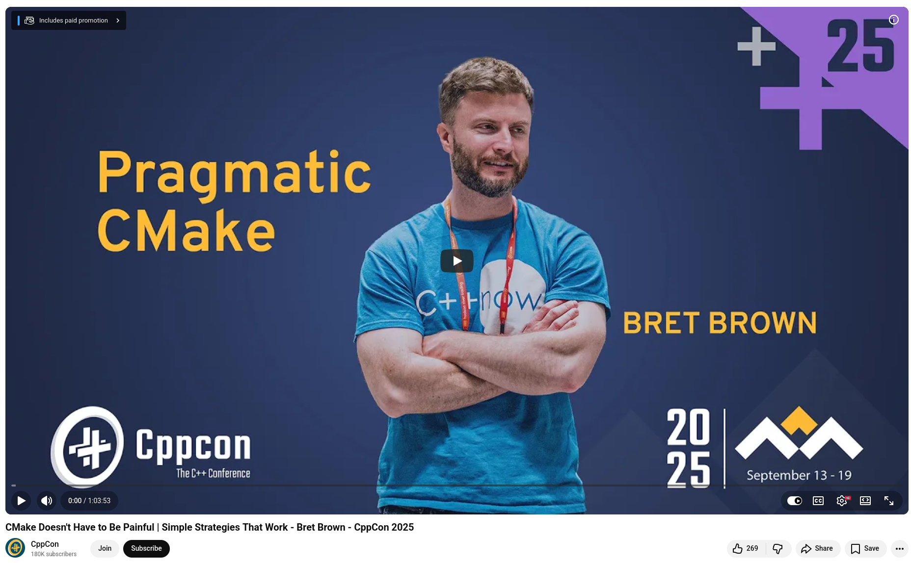

# CppCon: CMake doesn't have to be painful

At CppCon 2025, Bret Brown (Developer Experience @ Bloomberg) delivered one of the most practically useful CMake talks I've seen: "CMake Doesn't Have to Be Painful | Simple Strategies That Work."


After managing hundreds of CMake projects at Bloomberg, Brown's advice cuts against nearly everything LLMs and Stack Overflow have been teaching us: **Stop writing CMake like a programming language**. No loops. No conditionals where you can avoid them. No variables just to save typing. CMake is declarative. Treat it that way. It's called CMakeLists — not CMakeAlgorithms.


## A few principles that stuck with me:

+ **Be a passive project.** Don't set CMAKE_BUILD_TYPE, CMAKE_CXX_STANDARD, or other user-facing settings inside your CMakeLists.txt. Those belong in toolchain files or on the command line. Setting them in your project is how you break every consumer who disagrees with your defaults, and ABI incompatibilities from mismatched C++ standards can corrupt data silently in production.

+ **Use the -B flag.** cmake -B ./build keeps your build stateless. No more cd-ing around and losing track of where you are. Especially important for CI scripts and agentic workflows.

+ **Alias your targets with :: .** When a dependency name contains ::, CMake validates that the target actually exists, instead of silently slapping an unknown name onto the linker command line and failing later in a confusing way.

+ **Use FILE_SET HEADERS.** This newer feature (landed in recent CMake releases) ties your headers to your library target properly. It fixes include paths, enables header verification, and makes installs work correctly, without target_include_directories hacks.

+ **cmake --build, ctest, cmake --install.** Know these commands. Use them. Stop relying on generator-specific commands like make or ninja directly.

+ **Bump cmake_minimum_required regularly.** It's not just a version gate, it's a compatibility mode that unlocks deprecation warnings, new features, and performance improvements.

💡  Brown also made a point that resonated: Stack Overflow CMake answers are often a decade old. LLMs learned from them. That's why they keep recommending outdated patterns.

💡  The good news? Modern CMake is genuinely good. The community is actively improving install workflows, code generation targets, and transitive dependency declarations. The foundation is solid if you know where to look.


# References
+ CMake Web page, [10 April 2026](https://cmake.org/)
+ CMake canonical C++ project, [10 April 2026](https://github.com/romz-pl/cmake-canonical-cxx-project)
+ CMake Doesn't Have to Be Painful | Simple Strategies That Work, CppCon 2025, [5 Feb 2026](https://www.youtube.com/watch?v=NDfTwOvWIao)


```
#CPlusPlus
#CMake
#CppCon
#SoftwareEngineering
#BuildSystems
```





