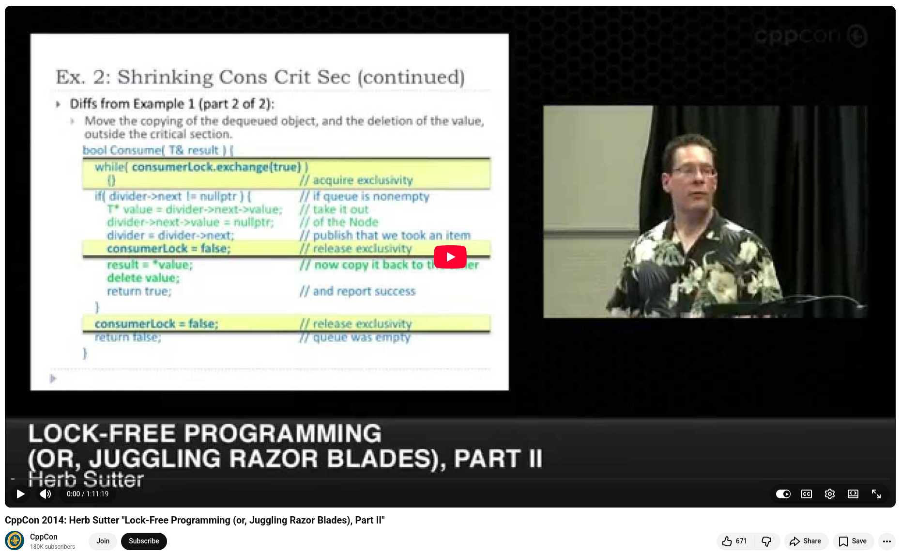

# Lock-Free Programming by Herb Sutter CppCon 2014

"If you think using atomics is easy, you're either jaded, one of 50 people in the world — or not being careful enough."

That opening line from Herb Sutter's iconic CppCon 2014 talk Lock-Free Programming (or, Juggling Razor Blades) sets the tone perfectly. This is a two-hour deep dive that every serious C++ engineer should have in their back pocket.

## Here are the core ideas that stuck with me:

+ **Lock-free is an optimization tool, not the default setting.** Before using atomics, you should measure first. After writing your shiny new lock-free algorithm, measure again. Measure again. More often than not, the expected improvement simply isn't there.

+ **Think in terms of transactions.** Model every member function and every locked region as a transition from one valid state to another. This mental model makes lock-free reasoning possible. A single atomic write can cause a whole graph of objects to come into existence for other threads. This is powerful, but only if you reason about it rigorously.

+ **Locks and atomics are not mutually exclusive.** Sutter explains producer-consumer designs in which ownership transitions between subsystems. In one phase, the transition is protected by a mutex; in the next phase, it is handed off via an atomic. The rule is simple: at any given moment in an object's lifetime, all threads must agree on how access is synchronized. This mechanism can change across phases.

+ **Weight-free → lock-free → obstruction-free.** These aren't just academic labels. They provide meaningful guarantees about system-wide throughput, starvation, and liveness. Knowing which level your algorithm achieves is important for reasoning about scalability under load.

+ **The size of the critical section is a scalability dial.** The mail-slots example illustrates this beautifully. Releasing a slot before or after doing the work is a subtle yet consequential decision, and the correct answer depends on whether the bottleneck is your producer or your consumers. The code looks almost identical either way. However, the performance implications are not.


💡 If you work in systems programming, high-performance infrastructure, or any field where concurrency matters, this talk is worth your time. It won't make lock-free programming easy. But it will help you understand exactly why it isn't.

 


## References
+ Herb Sutter, "Lock-Free Programming (or, Juggling Razor Blades), Part I", CppCon 2014, [16 Oct 2014](https://www.youtube.com/watch?v=c1gO9aB9nbs)
+ Herb Sutter, "Lock-Free Programming (or, Juggling Razor Blades), Part II", CppCon 2014, [16 Oct 2014](https://www.youtube.com/watch?v=CmxkPChOcvw)

```
#cpp
#concurrency
#lockfree
#cppcon
#performanceengineering
```



