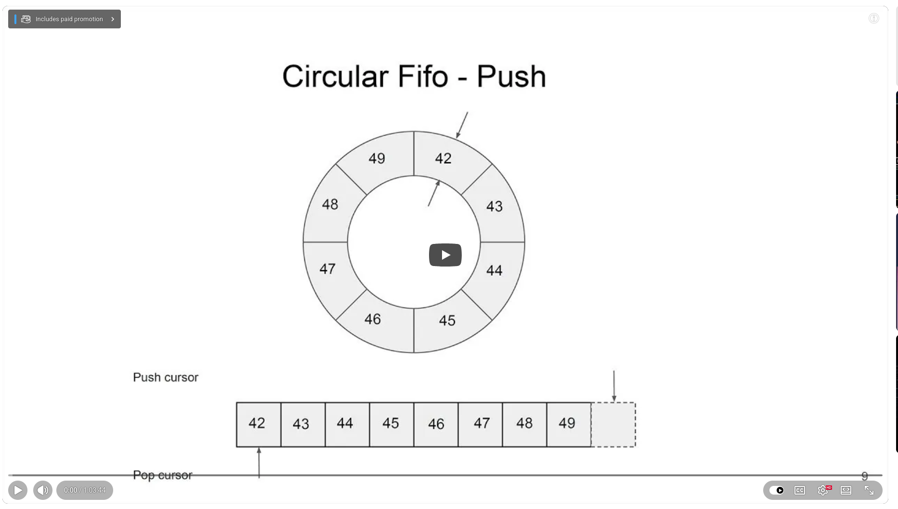

# Lock-Free Single Producer Single Consumer FIFO


At CppCon 2023, Charles Frasch presented a talk on the construction of a single producer, single consumer (SPSC) lock-free, wait-free FIFO from the ground up. The talk's focus on performance alone makes it unmissable.

## The progression is as follows:

+ **FIFO2**: Naive implementation with std::atomic cursors (sequential consistency by default): ~12–13 million operations per second (ops/sec).

+ **FIFO3**: Switched to relaxed/acquire-release memory ordering and fixed false sharing by aligning cursors to cache line boundaries (std::hardware_destructive_interference_size): ~50 million ops/sec (~4x improvement).

+ **FIFO4**: Added cached cursor copies to avoid unnecessary atomic loads when the queue is not full or empty: ~165 million ops/sec (~3.5x improvement over FIFO3).

+ **FIFO5**: Introduced smart-pointer-style Pusher/Popper proxies to allow direct in-place construction, cutting memory copies in half: comparable throughput with reduced copy overhead.

## Key lessons from the talk:

+ **Data races are silent killers**. The naive version passed the unit tests in debug mode but failed in release mode. Always run ThreadSanitizer. Always.

+ **False sharing is costly**. When push and pop cursors are on the same cache line, they create cache coherency traffic between cores. Moving them to individual cache lines delivered a massive speed boost.

+ **Sequential consistency is a blunt instrument**. The default memory ordering on std::atomic is excessive. Switching to memory_order_acquire/memory_order_release and memory_order_relaxed, when safe, removes unnecessary synchronization overhead.

+ **Measure everything**. Boost.Lockfree's SPSC queue performed worse than FIFO4 in benchmarks, likely due to compiler opacity around functors. Always profile with your actual compiler and flags.

+ **Index computation is important**. The % operator costs 20–30 cycles. However, constraining capacity to a power of two and using the bitwise & operator reduces that cost to a single cycle.

💡 The talk is a masterclass in the intersection of C++ memory model theory and practical systems engineering. Whether you're building trading pipelines, real-time audio, or any producer-consumer architecture, the principles here apply directly.


## References
+ Charles Frasch, "Single Producer Single Consumer Lock-free FIFO From the Ground Up", CppCon 2023, [22 Feb 2024](https://www.youtube.com/watch?v=K3P_Lmq6pw0)


```
#CppCon
#LockFree
#HighPerformance
#ConcurrentProgramming 
#LowLatency
```


