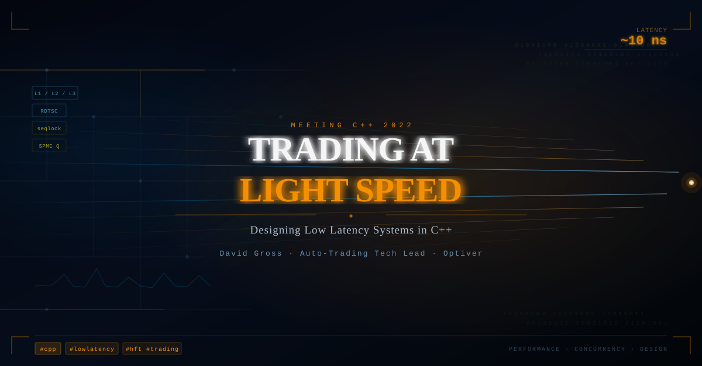

# Trading at light speed by David Gross


I recently watched David Gross's talk at Meeting C++ 2022, and it's one of the most practical sessions on low-latency system design that I've come across. David is the auto-trading tech lead at Optiver and brings nearly a decade of hard-won production experience to every point he makes.


## ⚡ Performance is a design decision, not a fix

Knuth's famous quote about premature optimization applies to tactics or local micro-optimizations. However, strategy—your overall architectural approach to performance—cannot be an afterthought. These two ideas aren't contradictory. They operate at different levels.


## 📦 Data model is everything

If your profiler shows no hotspots and slowness everywhere, then the problem is with the data model. Your working set doesn't fit in the cache. David's concrete example involves replacing a node-based container with random heap allocation with a custom stable_vector, which is a std::vector of pre-allocated chunks.
The takeaway: Consider the cache hierarchy before writing any business logic.


## 🔒 Seqlocks for lock-free state sharing

For sharing state between one producer and many consumers, David advocates for the seqlock. The producer is always wait-free. No reader can ever block it. For systems with one writer and up to 100 readers, it's nearly perfect. 


## 📬 SPMC queues for event fan-out

David walks through a custom single-producer, multi-consumer ring buffer for pushing events to many consumers with sub-100 ns jitter. The key insight is that, instead of using a shared read index, which creates a bottleneck, a per-element seqlock is embedded directly into each slot.


## 🖥️ System tuning matters as much as code

Even perfect code can fail on an untuned server. Two often-overlooked culprits are:
 + **P-states**: Your CPU may run at 400 MHz when idle. When a million messages arrive in under a second, it is not possible to ramp up the frequency mid-burst.
 + **C-states**: Deep idle states flush CPU caches. Waking up from a C-state with cold caches under load can be catastrophic for latency.


## 📊 If you don't measure it in production, it doesn't exist

The final section makes a strong point: latency on day one is irrelevant if you don't continuously track it. His recommendation is to build timestamping and metrics collection into your design from day one using RDTSC, lock-free queues for metric collection, and automated alerting against statistical thresholds.


💡 This talk is a masterclass in translating hardware reality into C++ architecture. 


## References
+ 🎥 David Gross, "Trading at light speed: designing low latency systems in C++", Meeting C++ 2022, [2 Jan 2023](https://www.youtube.com/watch?v=8uAW5FQtcvE)


```
#CppCon
#LockFree
#HighPerformance
#ConcurrentProgramming 
#LowLatency
```



