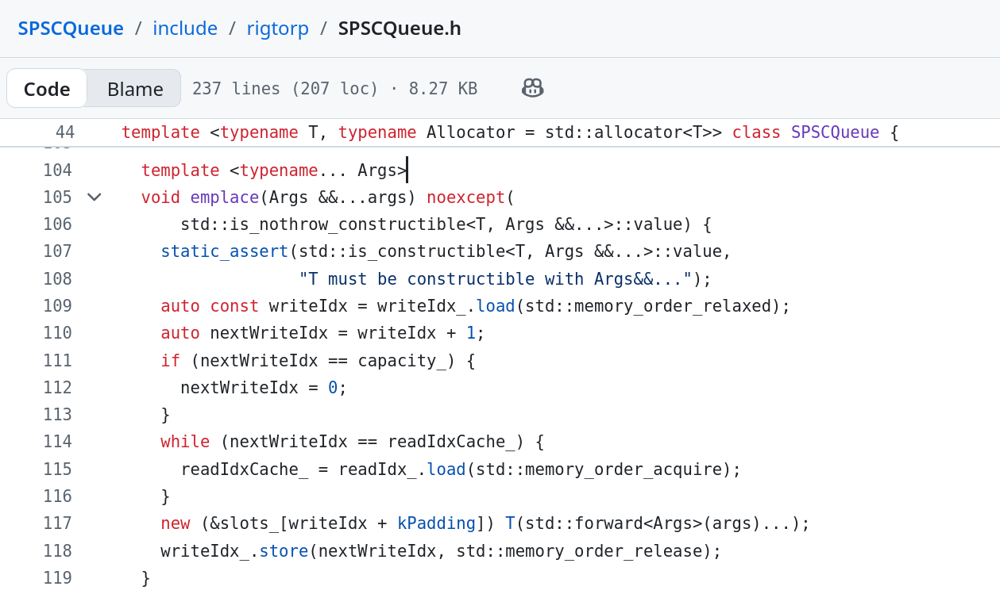

# Microseconds matter. Ring Buffer (SPSC queue) by Erik Rigtorp

In high-frequency trading, latency and throughput aren't just engineering metrics; they're competitive advantages. When your system processes millions of market events per second, each cache miss has real consequences.

A ring buffer, also known as a circular buffer or SPSC queue, is one of **the most fundamental data structures in the low-latency stack**. It enables wait-free, lock-free communication between producer and consumer threads, which is ideal for applications such as market data feeds racing against order execution engines.

Erik Rigtorp's article, "Optimizing a Ring Buffer for Throughput," is a masterclass on the subject. Starting with a correct but naive implementation, Rigtorp demonstrates how a single optimization, caching the remote index, can improve throughput by 20x:

➡ Baseline:  5.5M items/s
➡ Optimized: 112M items/s

The culprit? **Cache coherency traffic**. In a naive SPSC queue, each push reads the read index, and each pop reads the write index. Under the MESI protocol, this causes constant L1 cache-line invalidations across CPU cores, especially on AMD's multi-chiplet CCX topology, roughly three cache misses per read/write pair.

The elegant fix is that each side keeps a local cached copy of the other side's index. The remote index is only re-read when the local cache indicates that the queue is either full or empty. This approach dramatically reduces cross-core coherency traffic while preserving correctness via acquire/release memory ordering.

The following key implementation details are worth noting:
▸ Align atomic indices to cache line boundaries using alignas(64) to prevent false sharing.
▸ Use std::memory_order_relaxed for local loads and acquire/release only at synchronization points.
▸ Consider using huge pages and batched push/pop for further scaling gains.


## Referencesa
+ Erik Rigtorp, "Optimizing a Ring Buffer for Throughput", [14 April 2026](https://rigtorp.se/ringbuffer/)
+ Erik Rigtorp, [SPSCQueue GitHub repo](https://github.com/rigtorp/SPSCQueue)

```
#HighFrequencyTrading
#LowLatency
#Cpp
#AlgorithmicTrading
#ConcurrentProgramming
```


