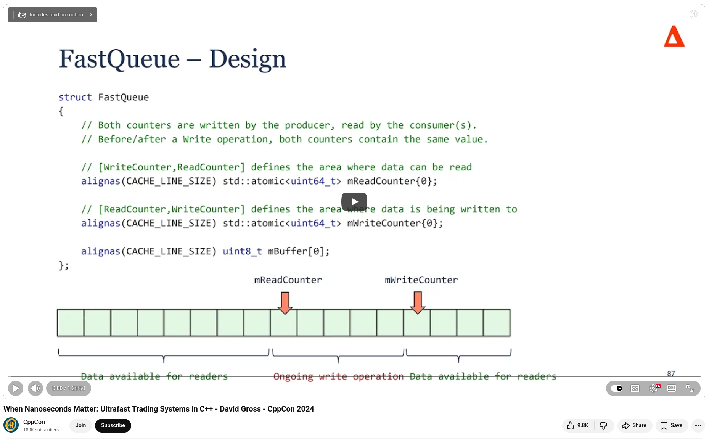
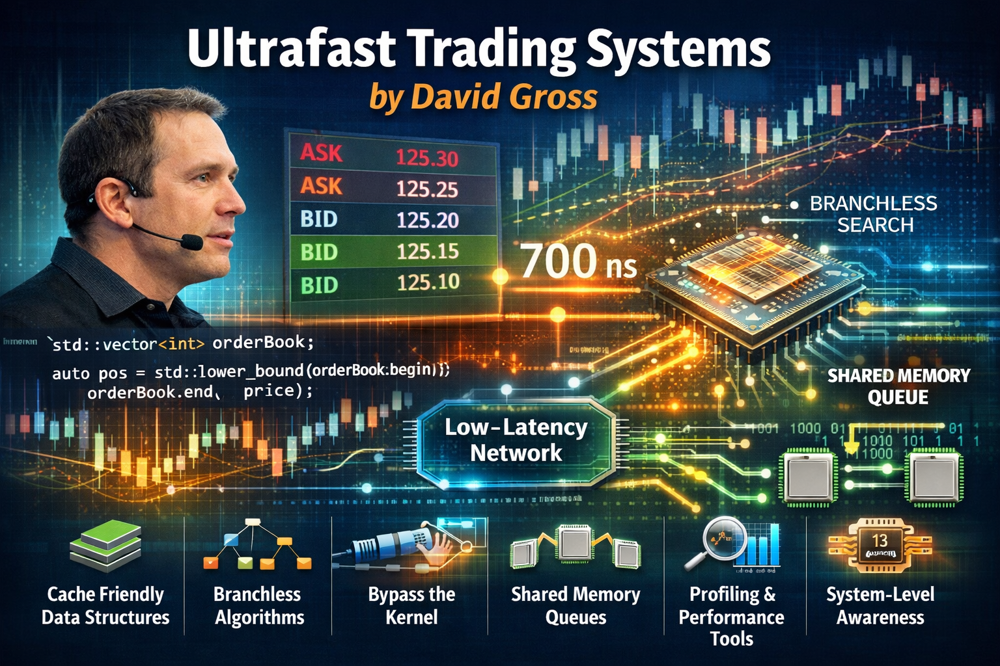

# Ultrafast Trading Systems by David Gross

At CppCon 2024, David Gross gave one of the most practical talks at the conference. He gave a deep dive into building low-latency trading systems from scratch.

From the start, his core message was clear: low latency is a design constraint, not an afterthought optimization.


## Understand your data before choosing your data structure
While optimizing an order book, David demonstrated that the `std::map data` structure exhibits poor cache locality when dealing with realistic workloads. Switching to a sorted `std::vector` with `lower_bound` dramatically improved performance.


## Avoid node-based containers by default
Avoid `std::map`, `std::set`, and `std::list` unless they are strictly necessary. Contiguous memory is not just a micro-optimization; it is a prerequisite for predictable, low-latency behavior.


## Branchless binary search has real tradeoffs
Eliminating branch mispredictions improved IPC. Branch mispredictions were measured at 25% bad speculation via Intel's Top-Down Analysis. However, branchless searches touch more memory due to the absence of an early exit. The ultimate winner? Linear search: simple, cache-friendly, and mechanically compatible with modern hardware.


## Bypass the kernel where possible
In terms of networking, user-space solutions (e.g., Solarflare's Onload/EFVI) can reduce latency from `~3 µs` to `~700 ns`. For local communication, shared memory over sockets is best.


## Design your concurrent queues carefully
David's shared-memory SPMC queue achieved strong performance through three targeted optimizations: batching writes to reduce atomic contention, avoiding unnecessary cache-line alignment, and caching the read counter locally. The result outperformed well-known IPC libraries.


## Staying fast is harder than getting fast
Essential profiling tools include perf, hardware counters, and Clang's XRay, which is runtime-patchable instrumentation with near-zero overhead. These tools are important not only for initial tuning but also for maintaining performance in production.


## You are not alone on that server
Perhaps the most underappreciated insight is that when multiple processes share an L3 cache, their memory access patterns interact. Even a single well-optimized process can be undermined by poorly designed neighbors. System-level thinking is essential.


💡 Simplicity and performance reinforce each other; they are not in tension. The fastest solution (linear search) was also the simplest. 


## References
+ 🎥 David Gross, "When Nanoseconds Matter: Ultrafast Trading Systems in C++", CppCon 2024, [28 Feb 2025](https://www.youtube.com/watch?v=sX2nF1fW7kI)


```
#CppCon
#LockFree
#HighPerformance
#HighFrequencyTrading
#LowLatency
```

Images generated by ChatGPT





