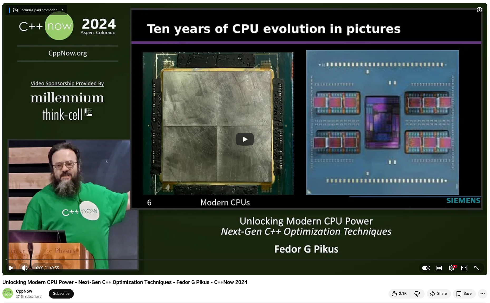
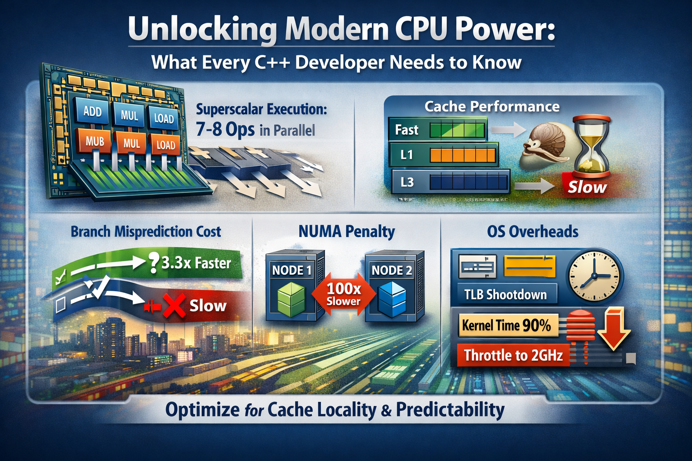
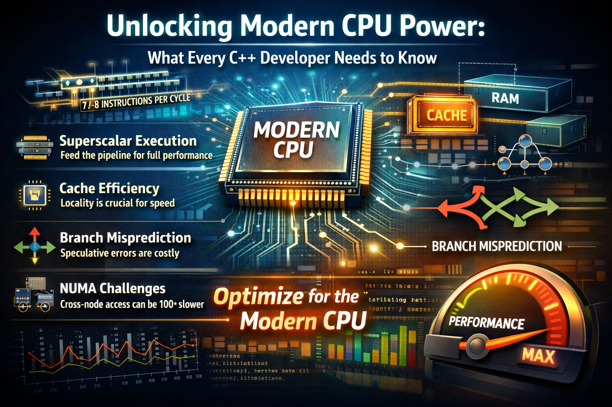

# Unlocking Modern CPU Power by Fedor G Pikus

I recently watched Fedor G. Pikus's talk at C++Now 2024, and it's one of the most practical and useful performance analyses I've seen in years. If you develop high-performance C++ applications, this talk deserves your full attention.

The core message is that optimizations that served you well a decade ago may actually hurt you today, and understanding the reasons why is fascinating.


## Superscalar execution has grown, but it needs to be fed
Modern CPUs can execute seven to eight operations simultaneously using only their scalar units. Ice Lake handles mixed instruction loads with over 90% efficiency, compared to 60% for Sky Lake. The catch? You only benefit if your code provides enough independent work. Data dependencies and memory-bound patterns prevent you from accessing this power.


## Caches are both your best friend and your biggest risk
When caches are properly disabled, column-major memory access on an Epic CPU is 22 times slower than row-major. This is a 2x worsening compared to older hardware. As CPUs become more powerful, the penalty for violating cache locality increases proportionally.


## The cost of branch misprediction is increasing
Longer pipelines mean more speculative work that must be discarded. On Ice Lake, a correctly predicted branch executes 3.3x faster than an incorrectly predicted one. Branchless transformations, which trade extra computation for predictability, are increasingly worthwhile.


## NUMA is the concurrency trap that doesn't get enough attention
On modern multi-die, multi-socket servers, sharing an atomic counter across NUMA nodes can be nearly 100 times slower than local access. Fedor demonstrates this by showing that a NUMA-aware thread pool can achieve 42 million tasks per second versus two million with a naive shared counter — a 21-fold improvement through hierarchical data structures and batched submission.


## The OS is part of your performance story
In one real-world case, TLB shootdowns triggered by NUMA page migrations consumed 90% of kernel time. Negligible network I/O caused an overall slowdown of 30% due to NUMA node imbalance. Monitoring the CPU frequency revealed that the CPU was running at 2 GHz instead of 3.3 GHz because it lacked the power budget to sustain full-core turbo under load.


💡 **The takeaway:** Modern CPUs favor smooth, predictable, cache-friendly code and penalize unpredictability much more than older hardware did.


## References
+ 🎥 Fedor G Pikus, "Unlocking Modern CPU Power - Next-Gen C++ Optimization Techniques", C++Now 2024, [19 Aug 2024](https://www.youtube.com/watch?v=wGSSUSeaLgA)


```
#CppCon
#LockFree
#HighPerformance
#HighFrequencyTrading
#LowLatency
```






